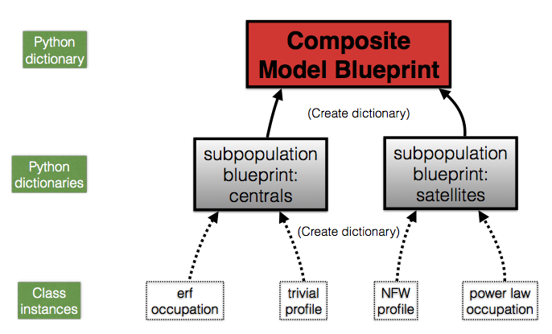

:orphan:

.. _hod_model_factory_overview:

****************************************************************
Factory Design for HOD/CLF-style models
****************************************************************

In this section of the documentation we'll cover the basic structure of any HOD/CLF-style dictionary, and conclude by using the `~halotools.empirical_models.Zheng07` composite model as a specific example. 

Structure of HOD/CLF model dictionarys 
---------------------------------------

As discussed in the :ref:`model_factory_overview`, the data structure of any composite model dictionary is a python dictionary. The set of key-value pairs in this dictionary constitutes the complete set of instructions required to build the composite model.  For HOD-style models, the keys of the composite model dictionary are the names of the galaxy population being modeled, e.g., `centrals` and `satellites`. The value of each key of an HOD-style composite model dictionary is itself a python dictionary; in Halotools lingo this second dictionary is called a *subpopulation dictionary*. This means that in HOD-style models, a composite model dictionary is actually a dictionary of dictionaries. So to build any HOD-style model, what you must do is build a collection of subpopulation dictionarys, and bundle the set of subpopulation dictionarys together into a composite model dictionary. The cartoon diagram below gives a schematic for the `~halotools.empirical_models.Zheng07` composite HOD model that we will look at in detail below. 

Let's start by looking at how the two subpopulation dictionarys are built, starting with the `satellites`. Like all python dictionaries, the satellite dictionary is specified by a set of key-value pairs. Each key of a subpopulation dictionary are just nicknames for the type feature; for the dictionary shown above, the Halotools convention is to use `occupation` for the feature governing the abundance of the galaxy type, while `profile` refers to the feature governing how the galaxy type is distributed within its dark matter halo. 

The value bound to each of the above keys are instances of Halotools classes, diagrammed here at the base of each arrow flowing into subpopulation dictionary. These class instances govern that particular feature. For example, suppose we wished for the spatial positions of satellites within their halos to follow an NFW profile. Then the value bound to the `profile` key of the satellite dictionary would be an instance of the `~halotools.empirical_models.NFWPhaseSpace` class. This particular feature is a class that is already in Halotools, but the framework described here provides you with the freedom to supplement Halotools with any feature(s) you write with your own code. 

A concrete example of a composite HOD model dictionary
---------------------------------------------------------------------------------------------------------------------

With the above picture in mind, let's now look at a specific example of how a composite model dictionary is built. For our example, we’ll use the particularly simple `~halotools.empirical_models.Zheng07` composite model, one of the fully-functional composite models that comes pre-built with Halotools in the `~halotools.empirical_models.composite_models` sub-package (see :ref:`composite_models_api`). 

All the functions in the `~halotools.empirical_models.composite_models` sub-package do the same thing: they build a composite model dictionary, pass the dictionary to the relevant factory, and return an instance of a composite model, as diagrammed in :ref:`model_factory_flowchart`. To help understand this example, have a look at the source code for the `~halotools.empirical_models.Zheng07` composite model while you read this section of the documentation. 

For definiteness, let’s look at how the Zheng07 composite model is built. The first chunk of code builds a dictionary called `subpopulation_dictionary_centrals`:

.. code:: python

    ### Build subpopulation dictionary for centrals
    subpopulation_dictionary_centrals = {}

    # Build the `occupation` feature
    occupation_feature_centrals = zheng07_components.Zheng07Cens(threshold = threshold, **kwargs)
    subpopulation_dictionary_centrals['occupation'] = occupation_feature_centrals

    # Build the `profile` feature
    profile_feature_centrals = TrivialPhaseSpace(**kwargs)
    subpopulation_dictionary_centrals['profile'] = profile_feature_centrals

The first key added to this subpopulation dictionary is `occupation`, and the value bound to this key is an instance of `~halotools.empirical_models.Zheng07Cens`. Note how the arguments passed to the Zheng07 function are in turn passed on to `~halotools.empirical_models.Zheng07Cens`, allowing you to customize the behavior of the central occupation statistics via the keyword arguments you pass to `~halotools.empirical_models.Zheng07`. The basic behavior that `~halotools.empirical_models.Zheng07Cens` controls is the mean number of central galaxies found in a halo; see the docstring of `~halotools.empirical_models.Zheng07Cens` for specific details of its options and implementation. 

The second key added to `subpopulation_dictionary_centrals` is `profile`, and the value bound to this key is an instance of the `~halotools.empirical_models.TrivialPhaseSpace` class. The behavior of `~halotools.empirical_models.TrivialPhaseSpace` is simple: our population of `centrals` will reside at the exact center of its host halo and will be at rest in the frame of the halo.

In principle, the keys to a subpopulation dictionary can be any string that you like. For the sake of consistency, the Halotools convention for HOD-style model dictionarys is to use the string `occupation` to contain the instructions for the occupation statistics of a given population, and the string `profile` to contain the instructions for modeling the intra-halo phase space distribution.

At this point, we have finished building the subpopulation dictionary for centrals and we move on to satellites. The process is exactly the same as before, only now we build `subpopulation_dictionary_satellits`, and use `~halotools.empirical_models.Zheng07Sats` and `~halotools.empirical_models.NFWPhaseSpace` as our component models:

.. code:: python

    ### Build subpopulation dictionary for satellites
    subpopulation_dictionary_centrals = {}

    # Build the occupation model
    occupation_feature_satellites = zheng07_components.Zheng07Sats(threshold = threshold, **kwargs)
    occupation_feature_satellites._suppress_repeated_param_warning = True
    subpopulation_dictionary_satellites['occupation'] = occupation_feature_satellites

    # Build the profile model
    profile_feature_satellites = NFWPhaseSpace(**kwargs)    
    subpopulation_dictionary_satellites['profile'] = profile_feature_satellites

In a `~halotools.empirical_models.Zheng07` universe, galaxies are either `centrals` or `satellites`, and the only attributes they have are position and velocity. So the above two dictionaries are all we need to build a composite model dictionary. This building process is simple: we just create a new dictionary with one key for `centrals` and another for `satellites`, and bind the subpopulation dictioaries to these keys:

.. code:: python

    ### Compose subpopulation dictionarys together into a composite dictionary
    composite_model_dictionary = {
        'centrals' : subpopulation_dictionary_centrals,
        'satellites' : subpopulation_dictionary_satellites 
        }

The final line of code in the `~halotools.empirical_models.Zheng07` function is to pass this composite model dictionary to the `~halotools.empirical_models.HodModelFactory`, which now has all the information necessary to build an instance of a composite model. 

.. code:: python 

    composite_model = factories.HodModelFactory(composite_model_dictionary)
    return composite_model

