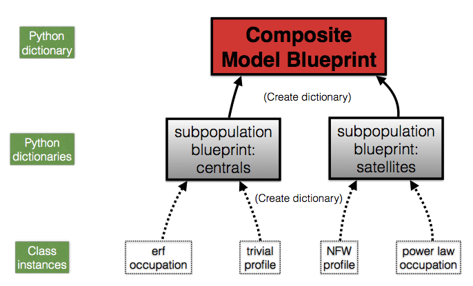

:orphan:

.. _hod_model_factory_overview:

****************************************************************
Factory Design for HOD/CLF-style models
****************************************************************

In this section of the documentation we'll cover the basic structure of any HOD/CLF-style blueprint, and conclude by using the `~halotools.empirical_models.Zheng07` composite model as a specific example. 

Structure of HOD/CLF model blueprints 
---------------------------------------

As discussed in the :ref:`model_factory_overview`, the data structure of any composite model blueprint is a python dictionary. The set of key-value pairs in this dictionary constitutes the complete set of instructions required to build the composite model.  For HOD-style models, the keys of the composite model blueprint are the names of the galaxy population being modeled, e.g., `centrals` and `satellites`. The value of each key of an HOD-style composite model blueprint is itself a python dictionary; in Halotools lingo this second dictionary is called a *subpopulation blueprint*. This means that in HOD-style models, a composite model blueprint is actually a dictionary of dictionaries. So to build any HOD-style model, what you must do is build a collection of subpopulation blueprints, and bundle the set of subpopulation blueprints together into a composite model blueprint. The cartoon diagram below gives a schematic for the `~halotools.empirical_models.Zheng07` composite HOD model that we will look at in detail below. 

Let's start by looking at how the two subpopulation blueprints are built, starting with the `satellites`. Like all python dictionaries, the satellite blueprint is specified by a set of key-value pairs. Each key of a subpopulation blueprint are just nicknames for the type feature; for the blueprint shown above, the Halotools convention is to use `occupation` for the feature governing the abundance of the galaxy type, while `profile` refers to the feature governing how the galaxy type is distributed within its dark matter halo. 

The value bound to each of the above keys are instances of Halotools classes, diagrammed here at the base of each arrow flowing into subpopulation dictionary. These class instances govern that particular feature. For example, suppose we wished for the spatial positions of satellites within their halos to follow an NFW profile. Then the value bound to the `profile` key of the satellite blueprint would be an instance of the `~halotools.empirical_models.NFWPhaseSpace` class. This particular feature is a class that is already in Halotools, but the framework described here provides you with the freedom to supplement Halotools with any feature(s) you write with your own code. 

A concrete example of a composite HOD model blueprint
---------------------------------------------------------------------------------------------------------------------

With the above picture in mind, let's now look at a specific example of how a composite model blueprint is built. For our example, we’ll use the particularly simple `~halotools.empirical_models.Zheng07` composite model, one of the fully-functional composite models that comes pre-built with Halotools in the `~halotools.empirical_models.composite_models. All the functions in the `~halotools.empirical_models.composite_models` sub-package do the same thing: they build a composite model blueprint, pass the blueprint to the relevant factory, and return an instance of a composite model, as diagrammed in :ref:`model_factory_flowchart`. To help understand this example, have a look at the source code for the `~halotools.empirical_models.Zheng07` composite model while you read this section of the documentation. 

For definiteness, let’s look at how the Zheng07 composite model is built. The first chunk of code builds a dictionary called `cen_model_dict`; this is our subpopulation_blueprint for a population of ‘centrals’. The first key added to cen_model_dict is ‘occupation’, and the value bound to this key is an instance of Zheng07Cens. Note how the arguments passed to the Zheng07 function are in turn passed on to Zheng07Cens. The basic behavior that Zheng07Cens controls is the mean number of central galaxies found in a halo; see the docstring of Zheng07Cens for specific details of its options and implementation. The second key added to cen_model_dict is ‘profile’, and the value bound to this key is an instance of the TrivialPhaseSpace class. The behavior of TrivialPhaseSpace is simple: our population of ‘centrals’ will reside at the exact center of its host halo and will be at rest in the frame of the halo.

Loose ends
-----------

The arguments you pass to these functions are in turn passed on to the component models; as we will see, this allows you to customize the behavior of the pre-built models.

