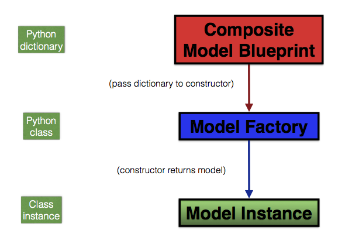

:orphan:

.. _model_factory_overview:

****************************************************************
Overview of the Model-Building Factories
****************************************************************

Halotools employs a factory design pattern to build *composite models* from a set of independently-defined *component models*. A component model governs one particular feature of one particular galaxy population. For example, 
`~halotools.empirical_models.NFWPhaseSpace` class is a component model that governs the intra-halo positions and velocities of satellites; `~halotools.empirical_models.Behroozi10` governs the stellar mass of centrals. On the other hand, a composite model governs *all* of the features of *every* galaxy population in your model universe. In this section of the documentation, we will give a detailed description of how the Halotools model factories are designed. The material covered here will be sufficient for you to understand how to use the Halotools framework to build a customized model of the galaxy-halo connection. 

Flowchart of the model factories
----------------------------------

The right side of the diagram is an information flowchart; the left side tells you the type of object used in each step. As described below, what you do is build a composite model blueprint and then pass that blueprint to the appropriate model factory class. Your blueprint is just passed as an input to the python class constructor in the usual way: as the argument to `__init__`. The factory class then interprets your blueprint as a set of instructions for how to build an instance of that model. Once you instantiate the model factory class, the resulting instance has all of the tools you need to generate a synthetic galaxy catalogs based on your model.

For documentation on HOD/CLF-style models that are based on host halos only, see :ref:`hod_model_factory_overview`; for documentation on abundance matching-style models that use subhalos, see :ref:`abunmatch_model_factory_overview`.

