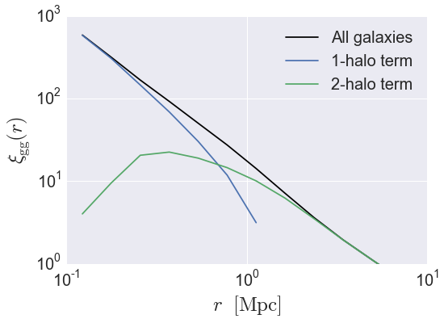

.. _galaxy_catalog_analysis_tutorial2:

Galaxy Catalog Analysis Example: Calculating galaxy clustering in 3d
========================================================================================

In this example, we'll show how to calculate the two-point clustering 
of a mock galaxy catalog, :math:`\xi_{\rm gg}(r)`. 
We'll also show how to compute cross-correlations between two different 
galaxy samples, and also the one-halo and two-halo decomposition 
:math:`\xi^{\rm 1h}_{\rm gg}(r)` and :math:`\xi^{\rm 2h}_{\rm gg}(r)`. 

There is also an IPython Notebook in the following location that can be 
used as a companion to the material in this section of the tutorial:

    **halotools/docs/notebooks/galcat_analysis/basic_examples/galaxy_catalog_analysis_tutorial2.ipynb**

By following this tutorial together with this notebook, 
you can play around with your own variations of the calculation 
as you learn the basic syntax. 

Generate a mock galaxy catalog 
---------------------------------
Let's start out by generating a mock galaxy catalog into an N-body
simulation in the usual way. Here we'll assume you have the *z=0*
rockstar halos for the bolshoi simulation, as this is the
default halo catalog. 

.. code:: python

    from halotools.empirical_models import PrebuiltSubhaloModelFactory
    model = PrebuiltSubhaloModelFactory('smhm_binary_sfr')
    from halotools.sim_manager import CachedHaloCatalog
    halocat = CachedHaloCatalog(simname = 'bolshoi', redshift = 0, halo_finder = 'rockstar')
    model.populate_mock(halocat)

Our mock galaxies are stored in the ``galaxy_table`` of ``model.mock``
in the form of an Astropy `~astropy.table.Table`.

Calculate two-point galaxy clustering :math:`\xi_{\rm gg}(r)`
-------------------------------------------------------------
The three-dimensional galaxy clustering signal is calculated by 
the `~halotools.mock_observables.tpcf` function from  
the *x, y, z* positions of the galaxies stored in the ``galaxy_table``. 
We can retrieve these arrays as follows:

.. code:: python

    x = model.mock.galaxy_table['x']
    y = model.mock.galaxy_table['y']
    z = model.mock.galaxy_table['z']

As described in :ref:`mock_obs_pos_formatting`, 
functions in the `~halotools.mock_observables` package 
such as `~halotools.mock_observables.tpcf` take array inputs in a 
specific form: a (*Npts, 3)*-shape Numpy array. You can use the 
`~halotools.mock_observables.return_xyz_formatted_array` convenience 
function for this purpose, which has a built-in *mask* feature 
that we'll also demonstrate to select positions of only those 
galaxies with :math:`M_{\ast}>10^{10}M_{\odot}.`

.. code:: python

    from halotools.mock_observables import return_xyz_formatted_array
    sample_mask = model.mock.galaxy_table['stellar_mass'] > 1e10
    pos = return_xyz_formatted_array(x, y, z, mask = sample_mask)

To calculate the clustering:

.. code:: python

    from halotools.mock_observables import tpcf

    import numpy as np
    rbins = np.logspace(-1, 1.25, 15)
    rbin_centers = (rbins[1:] + rbins[:-1])/2.

    xi_all = tpcf(pos, rbins, period = model.mock.Lbox, num_threads = 'max')

Decomposition into the 1-halo and 2-halo terms
~~~~~~~~~~~~~~~~~~~~~~~~~~~~~~~~~~~~~~~~~~~~~~~~

The ``tpcf_one_two_halo_decomp`` function calculates the two-point
correlation function, decomposed into contributions from galaxies in the
same halo, and galaxies in different halos. In order to use this
function, we must provide an input array of host halo IDs that are equal
for galaxies occupying the same halo, and distinct for galaxies in
different halos. We'll use the ``halo_hostid`` column for this purpose,
using the same ``sample_mask`` as above. 

.. code:: python

    from halotools.mock_observables import tpcf_one_two_halo_decomp

    halo_hostid = model.mock.galaxy_table['halo_hostid'][sample_mask]

    xi_1h, xi_2h = tpcf_one_two_halo_decomp(pos,
                    halo_hostid, rbins, 
                    period = model.mock.Lbox, 
                    num_threads='max')

Plot the results
~~~~~~~~~~~~~~~~

.. code:: python

    from seaborn import plt

    plt.plot(rbin_centers, xi_all, 
             label='All galaxies', color='k')
    plt.plot(rbin_centers, xi_1h, 
             label = '1-halo term')
    plt.plot(rbin_centers, xi_2h, 
             label = '2-halo term')

    plt.xlim(xmin = 0.1, xmax = 10)
    plt.ylim(ymin = 1, ymax = 1e3)
    plt.loglog()
    plt.xticks(fontsize=20)
    plt.yticks(fontsize=20)
    plt.xlabel(r'$r $  $\rm{[Mpc]}$', fontsize=25)
    plt.ylabel(r'$\xi_{\rm gg}(r)$', fontsize=25)
    plt.legend(loc='best', fontsize=20)

This tutorial continues with :ref:`galaxy_catalog_analysis_tutorial3`. 

