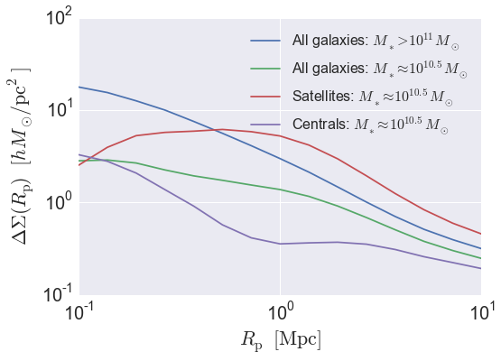

.. _galaxy_catalog_analysis_tutorial3:

Galaxy Catalog Analysis Example: Galaxy-galaxy lensing
=====================================================================================

In this example, we'll show how to calculate :math:`\Delta\Sigma(r),`
the galaxy-galaxy lensing signal of a mock catalog.

There is also an IPython Notebook in the following location that can be 
used as a companion to the material in this section of the tutorial:

    **halotools/docs/notebooks/galcat_analysis/basic_examples/galaxy_catalog_analysis_tutorial3.ipynb**

By following this tutorial together with this notebook, 
you can play around with your own variations of the calculation 
as you learn the basic syntax. 

Generate a mock galaxy catalog 
---------------------------------
Let's start out by generating a mock galaxy catalog into an N-body
simulation in the usual way. Here we'll assume you have the *z=0*
rockstar halos for the bolshoi simulation, as this is the
default halo catalog. 

.. code:: python

    from halotools.empirical_models import PrebuiltSubhaloModelFactory
    model = PrebuiltSubhaloModelFactory('smhm_binary_sfr')
    from halotools.sim_manager import CachedHaloCatalog
    halocat = CachedHaloCatalog(simname = 'bolshoi', redshift = 0, halo_finder = 'rockstar')
    model.populate_mock(halocat)

Extract subsamples of galaxies and dark matter particles 
------------------------------------------------------------------
Predictions for galaxy-galaxy lensing are calculated from the
cross-correlation between the galaxy positions and the dark matter
density field. For the latter, we will use the dark patter particle
positions stored in the ``ptcl_table`` attribute of the mock.

.. code:: python

    px = model.mock.ptcl_table['x']
    py = model.mock.ptcl_table['y']
    pz = model.mock.ptcl_table['z']

As described in :ref:`mock_obs_pos_formatting`, 
functions in the `~halotools.mock_observables` package 
such as `~halotools.mock_observables.delta_sigma` take array inputs in a 
specific form: a (*Npts, 3)*-shape Numpy array. You can use the 
`~halotools.mock_observables.return_xyz_formatted_array` convenience 
function for this purpose, which has a built-in *mask* feature 
that we'll also demonstrate to select a random downsampling of :math:`10^{5}` 
dark matter particles.

.. code:: python

    px = model.mock.ptcl_table['x']
    py = model.mock.ptcl_table['y']
    pz = model.mock.ptcl_table['z']

    from halotools.mock_observables import return_xyz_formatted_array

    import numpy as np
    Nptcls_to_keep = int(1e5)
    randomizer = np.random.random(len(model.mock.ptcl_table))
    sorted_randoms = np.sort(randomizer)
    ptcl_mask = np.where(sorted_randoms < sorted_randoms[Nptcls_to_keep])[0]
    particle_positions = return_xyz_formatted_array(px, py, pz, mask = ptcl_mask)

Now we'll extract the *x, y, z* positions of various subsamples of our galaxies. 

.. code:: python

    x = model.mock.galaxy_table['x']
    y = model.mock.galaxy_table['y']
    z = model.mock.galaxy_table['z']
    
    mstar11_mask = model.mock.galaxy_table['stellar_mass'] > 1e11
    mstar11_positions = return_xyz_formatted_array(x, y, z, mask = mstar11_mask)
    
    mstar105_mask = (model.mock.galaxy_table['stellar_mass'] > 10**10.3) & (model.mock.galaxy_table['stellar_mass'] < 10**10.7)
    mstar105_positions = return_xyz_formatted_array(x, y, z, mask = mstar105_mask)
    
    mstar105_central_mask = mstar105_mask * (model.mock.galaxy_table['halo_upid'] == -1)
    mstar105_central_positions = return_xyz_formatted_array(x, y, z, mask = mstar105_central_mask)
    
    mstar105_satellite_mask = mstar105_mask * (model.mock.galaxy_table['halo_upid'] != -1)
    mstar105_satellite_positions = return_xyz_formatted_array(x, y, z, mask = mstar105_satellite_mask)

Calculate :math:`\Delta\Sigma(R_{\rm p})`
-------------------------------------------------------------

.. code:: python

    from halotools.mock_observables import delta_sigma
    
    rp_bins = np.logspace(-1,1,15)
    pi_max = 40

    result_mstar11_in_mpc = delta_sigma(mstar11_positions, particle_positions, 
                         rp_bins, pi_max, period=model.mock.Lbox)
    
    result_mstar105_in_mpc = delta_sigma(mstar105_positions, particle_positions, 
                         rp_bins, pi_max, period=model.mock.Lbox)
    
    result_mstar105_central_in_mpc = delta_sigma(mstar105_central_positions, particle_positions, 
                         rp_bins, pi_max, period=model.mock.Lbox)
    
    result_mstar105_satellite_in_mpc = delta_sigma(mstar105_satellite_positions, particle_positions, 
                         rp_bins, pi_max, period=model.mock.Lbox)

Recall that all Halotools length units are comoving and in Mpc/h. However, the conventional units to 
plot :math:`\Delta\Sigma` are :math:`h*M_{\odot}/pc^2`, since in those units the galaxy-galaxy 
lensing signal is roughly order unity for typical :math:`L_{\ast}` galaxy samples. 
So now we convert units and plot the results. 

.. code:: python

    length_unit_conversion = 1e6
    result_mstar11_in_pc = result_mstar11_in_mpc/length_unit_conversion**2
    result_mstar105_in_pc = result_mstar105_in_mpc/length_unit_conversion**2
    result_mstar105_satellite_in_pc = result_mstar105_satellite_in_mpc/length_unit_conversion**2
    result_mstar105_central_in_pc = result_mstar105_central_in_mpc/length_unit_conversion**2

Plot the results 
~~~~~~~~~~~~~~~~~~~~
.. code:: python

    plt.plot(rp_bins, result_mstar11_in_pc, label=r'All galaxies: $M_{\ast} > 10^{11}M_{\odot}$')
    plt.plot(rp_bins, result_mstar105_in_pc, label=r'All galaxies: $M_{\ast} \approx 10^{10.5}M_{\odot}$')
    plt.plot(rp_bins, result_mstar105_satellite_in_pc, label=r'Satellites: $M_{\ast} \approx 10^{10.5}M_{\odot}$')
    plt.plot(rp_bins, result_mstar105_central_in_pc, label=r'Centrals: $M_{\ast} \approx 10^{10.5}M_{\odot}$')
    
    plt.xlim(xmin = 0.1, xmax = 10)
    plt.ylim(ymin = 0.1, ymax = 50000)
    plt.loglog()
    plt.xticks(fontsize=20)
    plt.yticks(fontsize=20)
    plt.xlabel(r'$R_{\rm p} $  $\rm{[Mpc / h]}$', fontsize=22)
    plt.ylabel(r'$\Delta\Sigma(R_{\rm p})$  $[h M_{\odot} / {\rm pc}^2]$', fontsize=22)
    plt.legend(loc='best', fontsize=16)

This tutorial continues with :ref:`galaxy_catalog_analysis_tutorial4`. 
