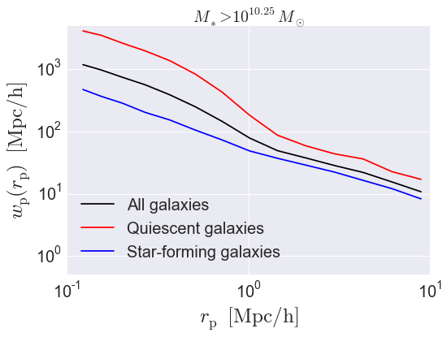
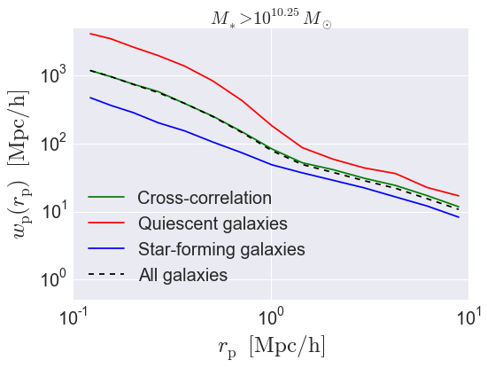

.. _galaxy_catalog_analysis_tutorial4:

Galaxy Catalog Analysis Example: Projected galaxy clustering
=====================================================================================

In this example, we'll show how to calculate :math:`w_{\rm p},` the
projected clustering signal of a mock catalog.

There is also an IPython Notebook in the following location that can be
used as a companion to the material in this section of the tutorial:

    **halotools/docs/notebooks/galcat_analysis/basic_examples/galaxy_catalog_analysis_tutorial4.ipynb**

By following this tutorial together with this notebook,
you can play around with your own variations of the calculation
as you learn the basic syntax.

Generate a mock galaxy catalog
---------------------------------
Let's start out by generating a mock galaxy catalog into an N-body
simulation in the usual way. Here we'll assume you have the *z=0*
rockstar halos for the bolshoi simulation, as this is the
default halo catalog.

.. code:: python

    from halotools.empirical_models import PrebuiltHodModelFactory
    model = PrebuiltHodModelFactory('tinker13', threshold = 10.25)
    from halotools.sim_manager import CachedHaloCatalog
    halocat = CachedHaloCatalog(simname='bolshoi', redshift=0, halo_finder='rockstar')
    model.populate_mock(halocat)

Extract subsamples of galaxy positions
------------------------------------------------------------------
The projected galaxy clustering signal is calculated by
the `~halotools.mock_observables.wp` function from
the *x, y, z* positions of the galaxies stored in the ``galaxy_table``.
We can retrieve these arrays as follows:

.. code:: python

    x = model.mock.galaxy_table['x']
    y = model.mock.galaxy_table['y']
    z = model.mock.galaxy_table['z']

As described in :ref:`mock_obs_pos_formatting`,
functions in the `~halotools.mock_observables` package
such as `~halotools.mock_observables.wp` take array inputs in a
specific form: a (*Npts, 3)*-shape Numpy array. You can use the
`~halotools.mock_observables.return_xyz_formatted_array` convenience
function for this purpose, which has a built-in *mask* feature
that we'll also demonstrate to select positions of quiescent and
star-forming populations.

.. code:: python

    from halotools.mock_observables import return_xyz_formatted_array

    all_positions = return_xyz_formatted_array(x, y, z)

    red_mask = (model.mock.galaxy_table['sfr_designation'] == 'quiescent')
    blue_mask = (model.mock.galaxy_table['sfr_designation'] == 'active')

    red_positions = return_xyz_formatted_array(x, y, z, mask = red_mask)
    blue_positions = return_xyz_formatted_array(x, y, z, mask = blue_mask)

Calculate :math:`w_{\rm p}(r_{\rm p})`
-------------------------------------------------------------
The correlation function :math:`w_{\rm p}(r_{\rm p})` is
related to the full redshift-space correlation function :math:`\xi(r_{\rm p}, \pi)`
via the following projection integral:

.. math::

    w_{\rm p}(r_{\rm p}) \equiv 2\int_{0}^{\pi_{\rm max}}{\rm d}\pi'\xi(r_{\rm p}, \pi')

When calculating :math:`w_{\rm p}`, we therefore need to specify both the
projected separation bins :math:`r_{\rm p}` and the line-of-sight
projection distance :math:`\pi_{\rm max}`.

.. code:: python

    from halotools.mock_observables import wp
    import numpy as np

    pi_max = 40.
    rp_bins = np.logspace(-1,1.25,15)

    wp_all = wp(all_positions, rp_bins, pi_max,
        period=model.mock.Lbox, num_threads='max')
    wp_red = wp(red_positions, rp_bins, pi_max,
        period=model.mock.Lbox, num_threads='max')
    wp_blue = wp(blue_positions, rp_bins, pi_max,
        period=model.mock.Lbox, num_threads='max')

Calculating cross-correlations
------------------------------
The `~halotools.mock_observables.wp` function also supports
calculating the cross-correlation
between two different samples. Here we'll show how to calculate the
red-red, blue-blue, and red-blue clustering all in a single call to
`~halotools.mock_observables.wp`.

.. code:: python

    wp_red_red, wp_red_blue, wp_blue_blue = wp(red_positions, rp_bins, pi_max,
                                               sample2 = blue_positions,
                                               period=model.mock.Lbox, num_threads='max',
                                               do_auto = True, do_cross = True)

This tutorial continues with :ref:`galaxy_catalog_analysis_tutorial5`.

