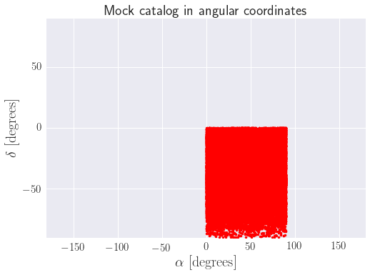
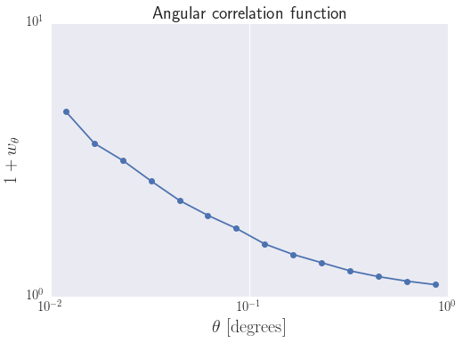
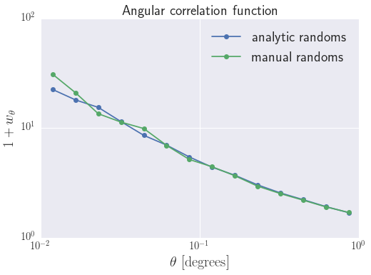
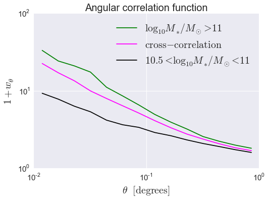

.. _galaxy_catalog_analysis_tutorial9:

Galaxy Catalog Analysis Example: Angular galaxy clustering
============================================================

In this example, we'll show how to calculate :math:`w(\theta),` the
angular clustering of a mock galaxy catalog. Since cosmological
simulations occupy a periodic cube and the angular correlation is
calculated in spherical coordinates, there are a few more steps that
this calculation takes relative to the three-dimensional correlation
function :math:`\xi(r)`.

Generate a mock galaxy catalog
------------------------------

Let's start out by generating a mock galaxy catalog into an N-body
simulation in the usual way. Here we'll assume you have the *z=0*
rockstar halos for the bolshoi simulation, as this is the default halo
catalog.

.. code:: python

    from halotools.empirical_models import PrebuiltSubhaloModelFactory
    model = PrebuiltSubhaloModelFactory('behroozi10')

    from halotools.sim_manager import CachedHaloCatalog
    halocat = CachedHaloCatalog(simname = 'bolshoi', redshift=0)
    model.populate_mock(halocat)

Extract subsamples of galaxy positions
--------------------------------------

In order to place our mock into angular coordinates, we'll use the
`~halotools.mock_observables.mock_survey` function. This function
expects a multi-dimensional array of spatial coordinates as input. The
code below shows how to transform our *x, y, z* coordinates into the
expected form.

.. code:: python

    mask = model.mock.galaxy_table['stellar_mass'] > 10**10.5
    gals = model.mock.galaxy_table[mask]
    coords = np.vstack([gals['x'], gals['y'], gals['z']]).T
    vels = np.vstack([gals['vx'], gals['vy'], gals['vz']]).T

Transform to *ra, dec, z* coordinates
-------------------------------------

We now have our simulation box populated with mock galaxies. To
transform these points into angular coordinates, we'll use the
`~halotools.mock_observables.mock_survey` function. This function uses
the origin (0, 0, 0) as the point where an observer would look out and
observe the points filling the box.

.. code:: python

    from halotools.mock_observables import mock_survey
    ra, dec, z = mock_survey.ra_dec_z(coords, vels, cosmo=model.mock.cosmology)
    ra = np.degrees(ra)
    dec = np.degrees(dec)

Since the three-dimensional region our mock occupies is the volume
spanned by [0, Lbox], an observer standing at the origin would see that
the mock universe subtends one octant of the sky. We can see that in the
plot below.

.. code:: python

    from seaborn import plt

    plt.plot(ra,dec,'.',color='red')
    plt.xlim([-180,180])
    plt.ylim([-90,90])
    plt.ylabel(r'$\delta$  $[{\rm degrees}]$', fontsize=20)
    plt.xlabel(r'$\alpha$  $[{\rm degrees}]$', fontsize=20)
    plt.xticks(size=15)
    plt.yticks(size=15)
    plt.title('Mock catalog in angular coordinates', fontsize=20)

Generate randoms in *ra, dec, z* space
--------------------------------------

Since our mock catalog occupies a non-trivial geometry (a spherical
octant), in order to calculate :math:`w(\theta)` we need to generate a
catalog of random points that occupies the same volume. To do this,
we'll just sprinkle random points in a [0, Lbox] cube and then transform
those points into angular space in the same way we did with our mock.

.. code:: python

    Nran=10**5
    ran_coords = np.random.random((Nran,3))*model.mock.Lbox
    ran_vels = np.zeros((Nran,3))
    
    ran_ra, ran_dec, ran_z = mock_survey.ra_dec_z(ran_coords, ran_vels, cosmo=model.mock.cosmology)
    ran_ra = np.degrees(ran_ra)
    ran_dec = np.degrees(ran_dec)

Calculate :math:`w(\theta)`
---------------------------

Finally, we'll use `~numpy.vp.vstack` once more to store our angular
coordinates into the multi-dimensional array shape expected by the
`~halotools.mock_observables.angular_tpcf` function.

.. code:: python

    from halotools.mock_observables import angular_tpcf
    
    angular_coords = np.vstack((ra,dec)).T
    ran_angular_coords = np.vstack((ran_ra,ran_dec)).T
    
    theta_bins = np.logspace(-2,0,15)
    cen_theta_bins = (theta_bins[:-1]+theta_bins[1:])/2.0

    w_theta_with_randoms = angular_tpcf(angular_coords, theta_bins, randoms=ran_angular_coords, num_threads='max')

.. code:: python

    plt.plot(cen_theta_bins,1.0+w_theta_with_randoms,'o-')
    plt.loglog()
    plt.ylabel(r'$1+w_{\theta}$', fontsize=20)
    plt.xlabel(r'$\theta$  $[{\rm degrees}]$', fontsize=20)
    _=plt.xticks(size=15)
    _=plt.yticks(size=15)
    _=plt.title('Angular correlation function', fontsize=20)

An alternative method without using randoms
-------------------------------------------

In the above calculation, the whole reason we needed to use randoms was
because our mock occupied a non-trivial region in angular space. But if
we instead shift our mock catalog so that the origin (0, 0, 0) is at the
center of the universe, then after we transform to angular coordinates
our mock will span the entire sphere and there will be no need for
randoms.

.. code:: python

    coords = np.vstack((gals['x'],gals['y'],gals['z'])).T - model.mock.Lbox/2.0
    vels = np.vstack((gals['vx'],gals['vy'],gals['vz'])).T
    
    ra_init, dec_init, z = mock_survey.ra_dec_z(coords, vels, cosmo=model.mock.cosmology)
    
    #keep a complete spherical volume
    r = np.sqrt(coords[:,0]**2 + coords[:,1]**2 + coords[:,2]**2)
    keep = r<model.mock.Lbox/2.0
    
    ra = np.degrees(ra_init[keep])
    dec = np.degrees(dec_init[keep])

Now observe that our mock data occupies the full sky

.. code:: python

    plt.plot(ra,dec,'.',color='blue', ms=2.0)
    plt.xlim([-180,180])
    plt.ylim([-90,90])
    plt.ylabel(r'$\delta$  $[{\rm degrees}]$', fontsize=20)
    plt.xlabel(r'$\alpha$  $[{\rm degrees}]$', fontsize=20)
    plt.xticks(size=15)
    plt.yticks(size=15)
    plt.title('Mock catalog in angular coordinates', fontsize=20)

.. image:: mock_fullsky.png

We can now calculate :math:`w(\theta)` without using randoms

.. code:: python

    angular_coords = np.vstack((ra,dec)).T
    w_theta = angular_tpcf(angular_coords, theta_bins, num_threads='max')

Let's do the same using randoms as a comparison

.. code:: python

    Nran=10**5
    ran_coords = np.random.random((Nran,3))*model.mock.Lbox - model.mock.Lbox/2.0
    ran_vels = np.zeros((Nran,3))
    
    ran_ra, ran_dec, ran_z = mock_survey.ra_dec_z(ran_coords, ran_vels, cosmo=model.mock.cosmology)
    
    #keep a complete spherical volume
    r = np.sqrt(ran_coords[:,0]**2 + ran_coords[:,1]**2 + ran_coords[:,2]**2)
    keep = r<model.mock.Lbox/2.0
    
    ran_ra = np.degrees(ran_ra[keep])
    ran_dec = np.degrees(ran_dec[keep])
    ran_angular_coords = np.vstack((ran_ra,ran_dec)).T
    
    w_theta_with_randoms = angular_tpcf(angular_coords, theta_bins, randoms=ran_angular_coords,\
                                        num_threads='max')

.. code:: python

    plt.plot(cen_theta_bins,1.0+w_theta,'o-', label='analytic randoms')
    plt.plot(cen_theta_bins,1.0+w_theta_with_randoms,'o-', label = 'manual randoms')
    plt.loglog()
    plt.ylabel(r'$1+w_{\theta}$', fontsize=20)
    plt.xlabel(r'$\theta$  $[{\rm degrees}]$', fontsize=20)
    plt.xticks(size=15)
    plt.yticks(size=15)
    plt.title('Angular correlation function', fontsize=20)
    plt.legend(loc='best', fontsize=20)

Calculating angular cross-correlations
--------------------------------------

The `~halotools.mock_observables.angular_tpcf` can also be used to
calculate cross-correlations.

.. code:: python

    mask1 = (gals['stellar_mass'] > 10**10.5) & (gals['stellar_mass'] < 10**11)
    mask2 = (gals['stellar_mass'] > 10**11) 
    
    sample1 = gals[mask1]
    sample2 = gals[mask2]

    coords1 = np.vstack((sample1['x'],sample1['y'],sample1['z'])).T - model.mock.Lbox/2.0
    coords2 = np.vstack((sample2['x'],sample2['y'],sample2['z'])).T - model.mock.Lbox/2.0
    vels1 = np.vstack((sample1['vx'],sample1['vy'],sample1['vz'])).T
    vels2 = np.vstack((sample2['vx'],sample2['vy'],sample2['vz'])).T
    
    ra_init1, dec_init1, z1 = mock_survey.ra_dec_z(coords1, vels1, cosmo=model.mock.cosmology)
    ra_init2, dec_init2, z2 = mock_survey.ra_dec_z(coords2, vels2, cosmo=model.mock.cosmology)
    
    # Throw out points that may have scattered beyond the box
    keep1 = z1<model.mock.Lbox/2.0
    keep2 = z2<model.mock.Lbox/2.0
    ra1 = np.degrees(ra_init1[keep1])
    ra2 = np.degrees(ra_init2[keep2])
    dec1 = np.degrees(dec_init1[keep1])
    dec2 = np.degrees(dec_init2[keep2])

    angular_coords1 = np.vstack((ra1,dec1)).T
    angular_coords2 = np.vstack((ra2,dec2)).T
    
    w_theta11, w_theta12, w_theta22 = angular_tpcf(angular_coords1, theta_bins, sample2=angular_coords2, 
                            num_threads='max', do_auto=True, do_cross=True)

Now plot the results 

.. code:: python

    plt.plot(cen_theta_bins,1.0+w_theta22,'-', color='green', 
             label = r'$\log_{10}M_{\ast}/M_{\odot} > 11$')
    plt.plot(cen_theta_bins,1.0+w_theta12,'-', color='magenta', 
             label = r'${\rm cross-correlation}$')
    plt.plot(cen_theta_bins,1.0+w_theta11,'-', color='k', 
             label = r'$10.5 < \log_{10}M_{\ast}/M_{\odot} < 11$')
    plt.loglog()
    plt.ylabel(r'$1+w_{\theta}$', fontsize=20)
    plt.xlabel(r'$\theta$  $[{\rm degrees}]$', fontsize=20)
    plt.xticks(size=15)
    plt.yticks(size=15)
    plt.title('Angular correlation function', fontsize=20)
    plt.legend(loc='best', fontsize=20)

