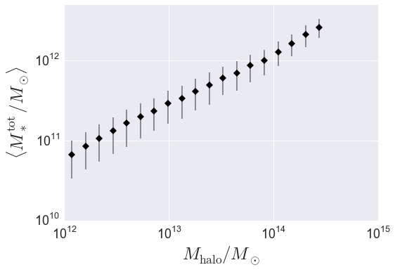
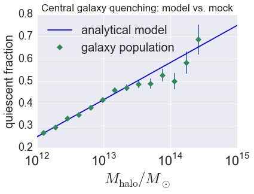

.. _galaxy_catalog_analysis_tutorial1:

Galaxy Catalog Analysis Example: Galaxy properties as a function of halo mass
========================================================================================

In this example, we'll show how to start from a sample of mock galaxies
and calculate how various galaxies properties scale with halo mass.
In particular, we'll calculate the average total stellar mass,
:math:`\langle M_{\ast}^{\rm tot}\vert M_{\rm halo}\rangle`, and also the average quiescent fraction
for centrals and satellites, :math:`\langle F_{\rm cen}^{\rm q}\vert M_{\rm halo}\rangle`
and :math:`\langle F_{\rm sat}^{\rm q}\vert M_{\rm halo}\rangle`.

There is also an IPython Notebook in the following location that can be
used as a companion to the material in this section of the tutorial:

    **halotools/docs/notebooks/galcat_analysis/basic_examples/galaxy_catalog_analysis_tutorial1.ipynb**

By following this tutorial together with this notebook,
you can play around with your own variations of the calculation
as you learn the basic syntax.

Generate a mock galaxy catalog
---------------------------------
Let's start out by generating a mock galaxy catalog into an N-body
simulation in the usual way. Here we'll assume you have the *z=0*
rockstar halos for the bolshoi simulation, as this is the
default halo catalog.

.. code:: python

    from halotools.empirical_models import PrebuiltSubhaloModelFactory
    model = PrebuiltSubhaloModelFactory('smhm_binary_sfr')
    from halotools.sim_manager import CachedHaloCatalog
    halocat = CachedHaloCatalog(simname = 'bolshoi', redshift = 0, halo_finder = 'rockstar')
    model.populate_mock(halocat)

Now suppose the data we are interested in is complete for
:math:`M_{\ast} > 10^{10}M_{\odot},` so we will make a cut on the mock.
Our mock galaxies are stored in the ``galaxy_table`` of ``model.mock``
in the form of an Astropy `~astropy.table.Table`.

.. code:: python

    sample_mask = model.mock.galaxy_table['stellar_mass'] > 1e10
    gals = model.mock.galaxy_table[sample_mask]

Calculate total stellar mass :math:`M_{\ast}^{\rm tot}` in each halo
------------------------------------------------------------------------------

To calculate the total stellar mass of galaxies in each halo, we'll use
the `halotools.utils.group_member_generator`. You can read more about the
details of that function in its documentation, here we'll just demo some basic usage.
Briefly, this generator can be used to iterate over your galaxy population
on a group-by-group basis, so that you can perform group-wise calculations
with each step of the iteration. In this case, at each step of the iteration
we'll sum up the stellar masses of each group's members.

The ``halo_hostid`` is a natural grouping key for a galaxy catalog whose
host halos are known. So we'll sort our galaxy catalog on this column,
notify the `~halotools.utils.group_member_generator` that we have done so
by passing in ``halo_hostid`` as the *grouping_key*, and then request that
the generator yield the data stored in the ``stellar_mass`` column
at each iteration. The we'll loop over the generator,
calculate the sum of the yielded stellar mass column,
and broadcast the result to each group member.

.. code:: python

    from halotools.utils import group_member_generator

    gals.sort('halo_hostid')
    grouping_key = 'halo_hostid'
    requested_columns = ['stellar_mass']
    group_gen = group_member_generator(gals, grouping_key, requested_columns)

    total_stellar_mass = np.zeros(len(gals))
    for first, last, member_props in group_gen:
        stellar_mass_of_members = member_props[0]
        total_stellar_mass[first:last] = sum(stellar_mass_of_members)

    gals['halo_total_stellar_mass'] = total_stellar_mass

Our ``gals`` table now has a ``halo_total_stellar_mass`` column.

Calculate host halo mass :math:`M_{\rm host}` of each galaxy
------------------------------------------------------------

Now we'll do a very similar calculation, but instead broadcasting the
host halo mass to each halo's members. Here we'll perform a two-property sort.
By sorting first on ``halo_hostid`` and then on ``halo_upid``, what we accomplish is that
galaxies sharing a common halo are grouped together, and then within each grouping
the true central galaxy appears first in the sequence. This means that when the
`~halotools.utils.group_member_generator` yields arrays to us, we can retrieve the
property of the central galaxy via the first element in each yielded array.
In this next calculation, we'll exploit that information to broadcast the
host halo virial mass to all members of the halo.

.. code:: python

    gals.sort(['halo_hostid', 'halo_upid'])
    grouping_key = 'halo_hostid'
    requested_columns = ['halo_mvir']
    group_gen = group_member_generator(gals, grouping_key, requested_columns)

    host_mass = np.zeros(len(gals))
    for first, last, member_props in group_gen:
        mvir_members = member_props[0]
        mvir_host = mvir_members[0]
        host_mass[first:last] = mvir_host

    gals['halo_mhost'] = host_mass

Our ``gals`` table now has a ``halo_mhost`` column.

Calculate :math:`\langle M_{\ast}^{\rm tot}\rangle` vs. :math:`M_{\rm halo}`
-------------------------------------------------------------------------------------------------

Now we'll exploit our previous calculations to compute the mean total stellar mass
in bins of halo mass. For this calculation,
the `~halotools.mock_observables.mean_y_vs_x` provides useful wrapper behavior around
`scipy.stats.binned_statistic` and `numpy.histogram`.
Note that `~halotools.mock_observables.mean_y_vs_x` is really just a convenience
function used for quick exploratory work. For results going into science publications,
be sure to check how your findings depend on bin width, sampling, etc.

.. code:: python

    from halotools.mock_observables import mean_y_vs_x
    import numpy as np

    bins = np.logspace(12, 15, 25)
    result = mean_y_vs_x(gals['halo_mhost'].data,
                         gals['halo_total_stellar_mass'].data,
                         bins = bins,
                         error_estimator = 'variance')

    host_mass, mean_stellar_mass, mean_stellar_mass_err = result

Plot the result
~~~~~~~~~~~~~~~~~~~~~~~~~~~~~~~~~~~~~~~~~~~~~~~~~~~~~~~~~~~~~

.. code:: python

    from seaborn import plt

    plt.errorbar(host_mass, mean_stellar_mass, yerr=mean_stellar_mass_err,
                 fmt = "none", ecolor='gray')
    plt.plot(host_mass, mean_stellar_mass, 'D', color='k')

    plt.loglog()
    plt.xticks(size=18)
    plt.yticks(size=18)
    plt.xlabel(r'$M_{\rm halo}/M_{\odot}$', fontsize=25)
    plt.ylabel(r'$\langle M_{\ast}^{\rm tot}/M_{\odot}\rangle$', fontsize=25)
    plt.ylim(ymax=5e12)

Quiescent fraction of centrals and satellites
----------------------------------------------

In this section we'll perform a very similar calculation to the above,
only here we'll compute the average quiescent fraction of centrals and satellites.

Calculate :math:`\langle F_{\rm q}^{\rm cen}\vert M_{\rm halo} \rangle` and :math:`\langle F_{\rm q}^{\rm sat} \vert M_{\rm halo}\rangle`
~~~~~~~~~~~~~~~~~~~~~~~~~~~~~~~~~~~~~~~~~~~~~~~~~~~~~~~~~~~~~~~~~~~~~~~~~~~~~~~~~~~~~~~~~~~~~~~~~~~~~~~~~~~~~~~~~~~~~~~~~~~~~~~~~~~~~~~~~~~~~~~~~~~~~~~~~~~~~~~~

In the above calculation, we needed to create new columns for our galaxy catalog, :math:`M_{\rm host}` and :math:`M_{\ast}^{\rm tot}`. Here we'll reuse the :math:`M_{\rm host}` column, and our model already created a boolean-valued ``quiescent`` column for our galaxies. So no group iteration is necessary; all we need to do is calculate the average trends as a function of halo mass.

.. code:: python

    cens_mask = gals['halo_upid'] == -1
    cens = gals[cens_mask]
    sats = gals[~cens_mask]

    bins = np.logspace(12, 14.5, 15)

    # centrals
    result = mean_y_vs_x(cens['halo_mhost'].data, cens['quiescent'].data,
                bins = bins)
    host_mass, fq_cens, fq_cens_err_on_mean = result

    # satellites
    result = mean_y_vs_x(sats['halo_mhost'].data, sats['quiescent'].data,
                bins = bins)
    host_mass, fq_sats, fq_sats_err_on_mean = result

Plot the result and compare it to the underlying analytical relation
~~~~~~~~~~~~~~~~~~~~~~~~~~~~~~~~~~~~~~~~~~~~~~~~~~~~~~~~~~~~~~~~~~~~~~~~~~~

.. code:: python

    plt.errorbar(host_mass, fq_cens, yerr=fq_cens_err_on_mean,
                 color='seagreen', fmt = "none")
    plt.plot(host_mass, fq_cens, 'D', color='seagreen',
                 label = 'galaxy population')

    analytic_result_mhost_bins = np.logspace(10, 15.5, 100)
    analytic_result_mean_quiescent_fraction = model.mean_quiescent_fraction(prim_haloprop = analytic_result_mhost_bins)
    plt.plot(analytic_result_mhost_bins,
             analytic_result_mean_quiescent_fraction,
             color='blue', label = 'analytical model')

    plt.xscale('log')
    plt.xticks(size=22)
    plt.yticks(size=18)
    plt.xlabel(r'$M_{\rm halo}/M_{\odot}$', fontsize=25)
    plt.ylabel('quiescent fraction', fontsize=20)
    plt.xlim(xmin = 1e12, xmax = 1e15)
    plt.ylim(ymin = 0.2, ymax=0.8)
    plt.legend(frameon=False, loc='best', fontsize=20)
    plt.title('Central galaxy quenching: model vs. mock', fontsize=17)

This tutorial continues with :ref:`galaxy_catalog_analysis_tutorial2`.
