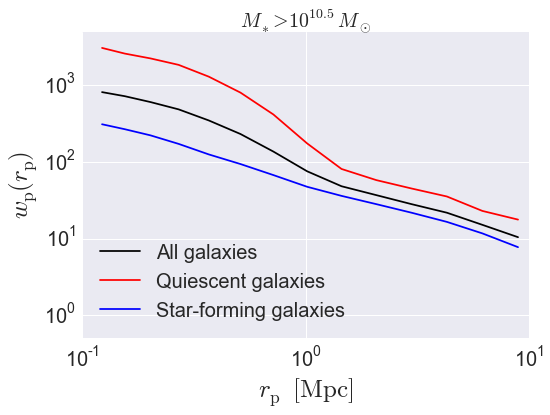

.. _galaxy_catalog_analysis_tutorial4:

Basic Galaxy Catalog Analysis Example 4: Projected galaxy clustering 
=====================================================================================

In this example, we'll show how to calculate :math:`w_{\rm p},` the
projected clustering signal of a mock catalog.

There is also an IPython Notebook in the following location that can be 
used as a companion to the material in this section of the tutorial:

    halotools/docs/notebooks/galcat_analysis/basic_examples/galaxy_catalog_analysis_tutorial4.ipynb

By following this tutorial together with this notebook, 
you can play around with your own variations of the calculation 
as you learn the basic syntax. 

Generate a mock galaxy catalog 
---------------------------------
Let's start out by generating a mock galaxy catalog into an N-body
simulation in the usual way. Here we'll assume you have the *z=0*
rockstar halos for the bolshoi simulation, as this is the
default halo catalog. 

.. code:: python

    from halotools.empirical_models import PrebuiltHodModelFactory
    model = PrebuiltHodModelFactory('tinker13', threshold = 10.25)
    model.populate_mock(simname = 'bolshoi', redshift = 0, halo_finder = 'rockstar')

Extract subsamples of galaxy positions 
------------------------------------------------------------------
The projected galaxy clustering signal is calculated by 
the `~halotools.mock_observables.wp` function from  
the *x, y, z* positions of the galaxies stored in the ``galaxy_table``. 
We can retrieve these arrays as follows:

.. code:: python

    x = model.mock.galaxy_table['x']
    y = model.mock.galaxy_table['y']
    z = model.mock.galaxy_table['z']

As described in :ref:`mock_obs_pos_formatting`, 
functions in the `~halotools.mock_observables` package 
such `~halotools.mock_observables.wp` take array inputs in a 
specific form: a (*Npts, 3)*-shape Numpy array. You can use the 
`~halotools.mock_observables.return_xyz_formatted_array` convenience 
function for this purpose, which has a built-in *mask* feature 
that we'll also demonstrate to select positions of quiescent and 
star-forming populations.

.. code:: python

    from halotools.mock_observables import return_xyz_formatted_array

    all_positions = return_xyz_formatted_array(x, y, z)

    red_mask = (model.mock.galaxy_table['sfr_designation'] == 'quiescent')
    blue_mask = (model.mock.galaxy_table['sfr_designation'] == 'active')

    red_positions = return_xyz_formatted_array(x, y, z, mask = red_mask)
    blue_positions = return_xyz_formatted_array(x, y, z, mask = blue_mask)

Calculate :math:`w_{\rm p}(r_{\rm p})`
-------------------------------------------------------------
When calculating :math:`w_{\rm p}`, we need to specify both the 
projected separation bins :math:`r_{\rm p}` and the line-of-sight 
separation bins :math:`\pi_{\rm los}`. Galaxy pairs will be counted in 
2-d bins :math:`r_{\rm p}-\pi_{\rm los}`, and then in each 
:math:`r_{\rm p}` bin the line-of-sight integral gives :math:`w_{\rm p}(r_{\rm p}`.
Thus the maximum value you set for the :math:`\pi_{\rm los}` bins determines 
:math:`pi_{\rm max}`. 

.. code:: python

    from halotools.mock_observables import wp
    import numpy as np

    pi_max = 40.
    rp_bins = np.logspace(-1,1.25,15)
    pi_bins = np.logspace(-1,np.log10(pi_max),15)

    wp_all = wp(all_positions, rp_bins, pi_bins, 
        period=model.mock.Lbox, num_threads='max')
    wp_red = wp(red_positions, rp_bins, pi_bins, 
        period=model.mock.Lbox, num_threads='max')
    wp_blue = wp(blue_positions, rp_bins, pi_bins, 
        period=model.mock.Lbox, num_threads='max')

Plot the results 
~~~~~~~~~~~~~~~~~~~~

.. code:: python

    rp_bin_centers = (rp_bins[:1] + rp_bins[1:])/2.

    plt.plot(rp_bin_centers, wp_all, 
             label=r'All galaxies', 
             color='k')
    plt.plot(rp_bin_centers, wp_red, 
             label=r'Quiescent galaxies', 
             color='red')
    plt.plot(rp_bin_centers, wp_blue, 
             label=r'Star-forming galaxies', 
             color='blue')

    plt.xlim(xmin = 0.1, xmax = 10)
    plt.ylim(ymin = 0.5, ymax = 5e3)
    plt.loglog()
    plt.xticks(fontsize=20)
    plt.yticks(fontsize=20)
    plt.xlabel(r'$r_{\rm p} $  $\rm{[Mpc]}$', fontsize=25)
    plt.ylabel(r'$w_{\rm p}(r_{\rm p})$', fontsize=25)
    plt.title(r'$M_{\ast} > 10^{10.25}M_{\odot}$', fontsize=20)
    plt.legend(loc='best', fontsize=20)

