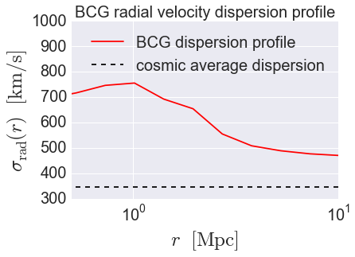

.. _galaxy_catalog_analysis_tutorial7:

Galaxy Catalog Analysis Example: Cluster BCG radial velocity dispersion profile
==================================================================================
In this example we'll show how to calculate the pairwise radial velocity
dispersion of galaxies relative to cluster BCGs,
:math:`\sigma_{\rm rad}^{2}(r)`. 
In particular, we'll use the `~halotools.empirical_models.Behroozi10SmHm` model 
to paint stellar masses onto subhalos, and then we'll select a 
population of :math:`M_{\ast}/M_{\odot}>10^{11.75}` galaxies as our BCG sample, 
and :math:`10^{10.75}<M_{\ast}/M_{\odot}<10^{11}` galaxies as the 
population we'll use as tracers of the velocity field. 

There is also an IPython Notebook in the following location that can be 
used as a companion to the material in this section of the tutorial:

    **halotools/docs/notebooks/galcat_analysis/basic_examples/galaxy_catalog_analysis_tutorial7.ipynb**

By following this tutorial together with this notebook, 
you can play around with your own variations of the calculation 
as you learn the basic syntax. 

Generate a mock galaxy catalog
------------------------------

Let's start out by generating a mock galaxy catalog into an N-body
simulation in the usual way. Here we'll assume you have the z=0 rockstar
halos for the bolshoi simulation, as this is the default halo catalog.

.. code:: python

    from halotools.empirical_models import PrebuiltSubhaloModelFactory
    model = PrebuiltSubhaloModelFactory('smhm_binary_sfr')
    from halotools.sim_manager import CachedHaloCatalog
    halocat = CachedHaloCatalog(simname = 'multidark', redshift = 0, halo_finder = 'rockstar')
    model.populate_mock(halocat)

Our mock galaxies are stored in the ``galaxy_table`` of ``model.mock``
in the form of an Astropy Table.

Extract the position and velocity coordinates
---------------------------------------------
To calculate the mean radial velocity between two sets of points, 
we need to know both their positions and velocities. 
As described in :ref:`mock_obs_pos_formatting`, 
functions in the `~halotools.mock_observables` package 
such as `~halotools.mock_observables.radial_pvd_vs_r` take array inputs in a 
specific form: a (*Npts, 3)*-shape Numpy array. You can use the 
`~halotools.mock_observables.return_xyz_formatted_array` convenience 
function for this purpose, which we will do after first 
selecting a tracer and a BCG population of mock galaxies. 

.. code:: python

    from halotools.mock_observables import return_xyz_formatted_array

    cluster_central_mask = (model.mock.galaxy_table['stellar_mass'] > 10**11.75)
    cluster_centrals = model.mock.galaxy_table[cluster_central_mask]

    cluster_pos = return_xyz_formatted_array(cluster_centrals['x'], 
        cluster_centrals['y'] ,cluster_centrals['z'])
    cluster_vel = return_xyz_formatted_array(cluster_centrals['vx'], 
        cluster_centrals['vy'] ,cluster_centrals['vz'])
    
    low_mass_tracers_mask = ((model.mock.galaxy_table['stellar_mass'] > 10**10.75) & 
                             (model.mock.galaxy_table['stellar_mass'] < 10**11))
    low_mass_tracers = model.mock.galaxy_table[low_mass_tracers_mask]
        
    low_mass_tracers_pos = return_xyz_formatted_array(low_mass_tracers['x'], 
        low_mass_tracers['y'] ,low_mass_tracers['z'])
    low_mass_tracers_vel = return_xyz_formatted_array(low_mass_tracers['vx'], 
        low_mass_tracers['vy'] ,low_mass_tracers['vz'])
    

Calculate :math:`\sigma_{\rm rad}(r)`
-------------------------------------

.. code:: python

    from halotools.mock_observables import radial_pvd_vs_r

    rbins = np.logspace(-0.5, 1.5, 15)
    rbin_midpoints = (rbins[1:] + rbins[:-1])/2.
    
    vdisp_clusters = radial_pvd_vs_r(cluster_pos, cluster_vel, rbins, 
                        sample2=low_mass_tracers_pos, velocities2=low_mass_tracers_vel, 
                        period = model.mock.Lbox, do_auto=False, do_cross=True)
    
    cosmic_avg = np.std(low_mass_tracers_vel[:,2])

Plot the result
~~~~~~~~~~~~~~~

.. code:: python

    from seaborn import plt
    
    plt.plot(rbin_midpoints, vdisp_clusters, color='red', 
             label = 'BCG dispersion profile')
    plt.plot(np.logspace(-2, 5, 100), np.zeros(100)+cosmic_avg, '--', color='k', 
             label = 'cosmic average dispersion')
    
    plt.xscale('log')
    plt.xlim(xmin = 0.5, xmax=10)
    plt.ylim(ymin = 300, ymax = 1000)
    plt.xticks(fontsize=20)
    plt.yticks(fontsize=20)
    plt.xlabel(r'$r $  $\rm{[Mpc]}$', fontsize=25)
    plt.ylabel(r'$\sigma_{\rm rad}(r)$  $[{\rm km/s}]$', fontsize=25)
    plt.title('BCG radial velocity dispersion profile', fontsize=20)
    plt.legend(fontsize=20, loc='best')

