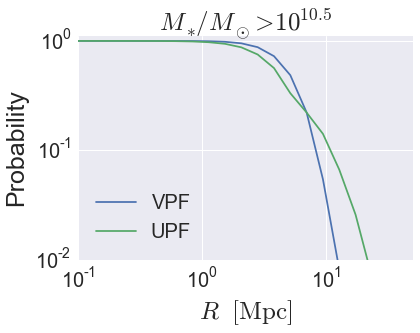

.. _galaxy_catalog_analysis_tutorial8:

Galaxy Catalog Analysis Example: Void probability function
==========================================================

In this example, we'll show how to calculate the void probability
function: the probability that a randomly placed sphere has zero
galaxies inside it, aka the VPF. 
We will also calculate the UPF, the probability that a random sphere has a
number density less than some threshold value.
See, e.g., `Tinker et al 2008 <http://arxiv.org/abs/0707.3445>`_, 
and references therein. 

There is also an IPython Notebook in the following location that can be 
used as a companion to the material in this section of the tutorial:

    **halotools/docs/notebooks/galcat_analysis/basic_examples/galaxy_catalog_analysis_tutorial8.ipynb**

By following this tutorial together with this notebook, 
you can play around with your own variations of the calculation 
as you learn the basic syntax. 

Generate a mock galaxy catalog
------------------------------

Let's start out by generating a mock galaxy catalog into an N-body
simulation in the usual way. Here we'll assume you have the z=0 rockstar
halos for the bolshoi simulation, as this is the default halo catalog.

.. code:: python

    from halotools.empirical_models import PrebuiltHodModelFactory
    model = PrebuiltHodModelFactory('leauthaud11')
    from halotools.sim_manager import CachedHaloCatalog
    halocat = CachedHaloCatalog(simname = 'bolshoi', redshift = 0, halo_finder = 'rockstar')
    model.populate_mock(halocat)

Our mock galaxies are stored in the ``galaxy_table`` of ``model.mock``
in the form of an Astropy Table.

Extract the position and velocity coordinates
---------------------------------------------
To calculate the mean radial velocity between two sets of points, 
we need to know both their positions and velocities. 
As described in :ref:`mock_obs_pos_formatting`, 
functions in the `~halotools.mock_observables` package 
such as `~halotools.mock_observables.void_prob_func` take array inputs in a 
specific form: a (*Npts, 3)*-shape Numpy array. You can use the 
`~halotools.mock_observables.return_xyz_formatted_array` convenience 
function for this purpose. 

.. code:: python

    x = model.mock.galaxy_table['x']
    y = model.mock.galaxy_table['y']
    z = model.mock.galaxy_table['z']

    from halotools.mock_observables import return_xyz_formatted_array
    pos = return_xyz_formatted_array(x, y, z)

Calculate the VPF 
----------------------

To calculate the VPF, we need to specify the bins that define the sizes of the 
randomly placed spheres, and we need to specify the number of spheres. Here will set 
``num_spheres`` to :math:`10^{5}`, but you should be sure to study the convergence 
properties of this statistic on your galaxy sample as part of your study. 

.. code:: python

    from halotools.mock_observables import void_prob_func

    rbins = np.logspace(-1, 1.5, 20)
    num_spheres = int(1e5)
    
    vpf = void_prob_func(pos, rbins, num_spheres, period=model.mock.Lbox)

Calculate the UPF 
----------------------
The UPF quantifies the likelihood that a randomly places sphere contains 
a number density below a given threshold. When calculating the UPF with 
the `~halotools.mock_observables.underdensity_prob_func` function, 
this threshold density is defined as the number *u* times the 
number density of the sample. 

.. code:: python

    from halotools.mock_observables import underdensity_prob_func

    u = 0.2
    upf = underdensity_prob_func(pos, rbins, num_spheres, period=model.mock.Lbox, u=u)

Plot the results 
~~~~~~~~~~~~~~~~~~~~~~~~

.. code:: python

    from seaborn import plt

    plt.plot(rbins, vpf, label='VPF')
    plt.plot(rbins, upf, label='UPF')
    
    plt.xlim(xmin = 0.1, xmax = 50)
    plt.ylim(ymin = 0.01, ymax = 1.1)
    plt.loglog()
    plt.xticks(fontsize=20)
    plt.yticks(fontsize=20)
    plt.xlabel(r'$R $  $\rm{[Mpc]}$', fontsize=25)
    plt.ylabel('Probability', fontsize=25)
    plt.legend(loc=3, fontsize=20)
    plt.title(r'$M_{\ast}/M_{\odot} > 10^{10.5}$', fontsize=25)

