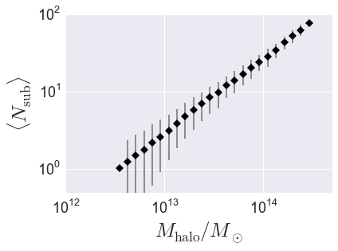

.. _halo_catalog_analysis_tutorial1:

Halo Catalog Analysis Example: halo properties as a function of host halo mass
==============================================================================

In this example, we'll show how to start from a subhalo catalog and
calculate how various properties scale with host halo mass. As a
specific example, we'll calculate the average abundance of subhalos as a
function of mass, :math:`\langle N_{\rm sub}\vert M_{\rm halo}\rangle`.

There is also an IPython Notebook in the following location that can be 
used as a companion to the material in this section of the tutorial:

    **halotools/docs/notebooks/halocat_analysis/basic_examples/halo_catalog_analysis_tutorial1.ipynb**

By following this tutorial together with this notebook, 
you can play around with your own variations of the calculation 
as you learn the basic syntax. 

Retrieve the default halo catalog
---------------------------------

.. code:: python

    from halotools.sim_manager import CachedHaloCatalog
    halocat = CachedHaloCatalog()
    print(halocat.halo_table[0:9])

.. parsed-literal::

    halo_vmax_firstacc halo_dmvir_dt_tdyn ... halo_hostid halo_mvir_host_halo
    ------------------ ------------------ ... ----------- -------------------
                  67.3             -5.505 ...  3058439856           2.031e+10
                 99.91             -9.513 ...  3058439861           4.443e+10
                 87.86             0.8171 ...  3058439904           9.882e+10
                 78.43             -1.356 ...  3058439906           3.108e+10
                 89.69              1.495 ...  3058439907           4.266e+10
                118.89             -6.333 ...  3058439910           1.728e+11
                123.38              4.487 ...  3058439952           1.867e+11
                109.28             -15.28 ...  3058439956           6.897e+10
                 84.17            -0.2037 ...  3058439985           3.339e+10

The first time you load the halo catalog into memory is slow because the
halo table is sorted into a convenient order and a large number of
self-consistency checks are performed. Subsequent calls to extract the
``halo_table`` are fast as the catalog is now available in RAM.

.. code:: python

    mask = halocat.halo_table['halo_mpeak'] > 1000*halocat.particle_mass
    halos = halocat.halo_table[mask]

Calculate total number of subhalos :math:`N_{\rm subs}` in each halo
--------------------------------------------------------------------

To calculate the total number of subhalos in each host halo, we'll use
the `halotools.utils.group_member_generator`. You can read more about
the details of the generator in its documentation, here we'll just demo
some basic usage. Briefly, this generator can be used to iterate over
your halo population on a host-by-host basis, so that you can perform
group-wise calculations with each step of the iteration. In this case,
at each step of the iteration we'll sum up the total number of subhalos
associated with each host.

As described in :ref:`rockstar_subhalo_nomenclature`,  
``halo_hostid`` is a natural grouping key for a subhalo catalog. 
So we'll sort our subhalo catalog on this column and 
notify the `~halotools.utils.group_member_generator` that we have done so 
by passing in ``halo_hostid`` as the *grouping_key* keyword argument. 
For this calculation, all we care about is the number of objects 
within each grouping, so there is no need to request the 
`~halotools.utils.group_member_generator` to yield any particular 
data about the subhalos, so we can simply set the 
*requested_columns* argument to be an empty list. 
After calling the generator with these arguments, 
we will then proceed to loop over the generator,  
calculate the number of subhalos in each host, 
and at the end store the result in a new column of the halo table. 

.. code:: python

    from halotools.utils import group_member_generator

    halos.sort('halo_hostid')
    grouping_key = 'halo_hostid'
    requested_columns = []
    group_gen = group_member_generator(halos, grouping_key, requested_columns)
    
    nsub = np.zeros(len(halos))
    for first, last, member_props in group_gen:
        nsub[first:last] = last - first - 1
    
    halos['num_subhalos'] = nsub

Our ``halos`` table now has a ``num_subhalos`` column.

Calculate :math:`\langle N_{\rm sub}\rangle` vs. :math:`M_{\rm halo}`
---------------------------------------------------------------------

Now we'll exploit our previous calculations to compute the mean number of subhalos 
in bins of halo mass. For this calculation, 
the `~halotools.mock_observables.mean_y_vs_x` provides useful wrapper behavior around 
`scipy.stats.binned_statistic` and `numpy.histogram`. 
Note that `~halotools.mock_observables.mean_y_vs_x` is really just a convenience 
function used for quick exploratory work. For results going into science publications, 
be sure to check how your findings depend on bin width, sampling, etc. 

.. code:: python

    from halotools.mock_observables import mean_y_vs_x
    import numpy as np 
    
    hostmask = halos['halo_upid'] == -1
    hosts = halos[hostmask]
    
    bins = np.logspace(12.5, 14.5, 25)
    result = mean_y_vs_x(hosts['halo_mvir_host_halo'], hosts['num_subhalos'], 
        bins = bins, error_estimator = 'variance') 
    
    host_mass, mean_richness, richness_variance = result

Plot the result
~~~~~~~~~~~~~~~

.. code:: python

    from seaborn import plt

    plt.errorbar(host_mass, mean_richness, yerr=richness_variance, 
                 fmt = "none", ecolor='gray')
    plt.plot(host_mass, mean_richness, 'D', color='k')
    
    plt.loglog()
    plt.xticks(size=18)
    plt.yticks(size=18)
    plt.xlabel(r'$M_{\rm halo}/M_{\odot}$', fontsize=25)
    plt.ylabel(r'$\langle N_{\rm sub}\rangle$', fontsize=25)
    plt.ylim(ymin = 0.5, ymax=100)
    plt.xlim(xmin = 1e12, xmax=5e14)

