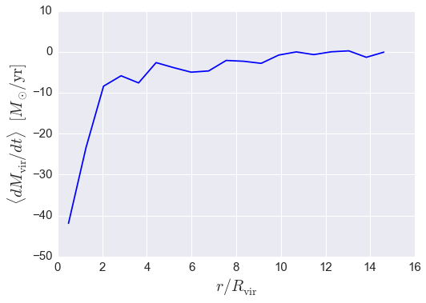
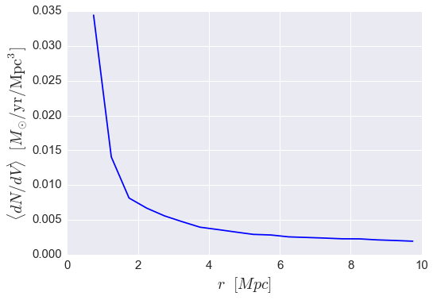

.. _halo_catalog_analysis_tutorial2:

Halo Catalog Analysis Example: calculating radial profiles
==========================================================

In this example, we'll show how to start from a subhalo catalog and calculate 
how various halo properties vary as a function of 3d distance from some nearby halo, 
i.e. we'll show how to use Halotools to calculate radial profiles. 
In particular, we'll see how the `~halotools.mock_observables.radial_profile_3d` function 
can be used to show that the mass accretion rate of halos
decreases as those halos approach a nearby cluster. We'll also show how to calculate 
the mean number density of some sample as a function of cluster-centric distance. 

Before following this tutorial, make sure you understand 
:ref:`halo_catalog_analysis_tutorial1`, as that tutorial
covers basic material such as how halo data is organized into an Astropy
Table object.

There is also an IPython Notebook in the following location that can be 
used as a companion to the material in this section of the tutorial:

    **halotools/docs/notebooks/halocat_analysis/basic_examples/halo_catalog_analysis_tutorial2.ipynb**

By following this tutorial together with this notebook, 
you can play around with your own variations of the calculation 
as you learn the basic syntax. 

Example 1: :math:`dM_{\rm vir}/dt` vs. halo-centric distance
------------------------------------------------------------

Let's start out by selecting two samples of halos from the ``Bolshoi``
simulation: one sample of group-mass host halos, and a second sample of
lower-mass halos.

Note that the lower-mass sample includes subhalos since we do not make a
``halo_upid`` cut.

.. code:: python

    from halotools.sim_manager import CachedHaloCatalog
    halocat = CachedHaloCatalog(simname = 'bolshoi', redshift = 0)
    
    host_mask = ((halocat.halo_table['halo_upid'] == -1) & 
                    (halocat.halo_table['halo_mvir'] > 1e13) & 
                    (halocat.halo_table['halo_mvir'] < 2e13))
    group_mass_hosts = halocat.halo_table[host_mask]
    
    low_mass_mask = ((halocat.halo_table['halo_mpeak'] > 5e11) & 
                    (halocat.halo_table['halo_mpeak'] < 6e11))
    low_mass_halos = halocat.halo_table[low_mass_mask]

The first question we will ask of these is halos is the following: how
does the mass accretion rate of (sub)halos vary as a function of the
distance to the group-mass hosts?

As with all `~halotools.mock_observables` functions that accept 3d positions for
arguments, we first format our positions into an array of the expected shape.

.. code:: python

    from halotools.mock_observables import return_xyz_formatted_array
    
    group_mass_hosts_pos = return_xyz_formatted_array(group_mass_hosts['halo_x'], group_mass_hosts['halo_y'], group_mass_hosts['halo_z'])
    low_mass_halos_pos = return_xyz_formatted_array(low_mass_halos['halo_x'], low_mass_halos['halo_y'], low_mass_halos['halo_z'])

The `~halotools.mock_observables.radial_profile_3d` function 
accepts two different kinds of inputs
for the separation bins. If you pass in ``rbins_normalized`` and
``normalize_rbins_by``, then this combination of arguments allows you to
calculate how various quantities vary as a function of, for example,
:math:`x = r / R_{\rm vir}.` The way this works is that the
``normalize_rbins_by`` argument stores the value of :math:`R_{\rm vir}`
for each point in ``sample1``, and the ``rbins_normalized`` argument
will be interpreted as referring to the distance of points in
``sample2`` scaled by this value.

In the following call to the `~halotools.mock_observables.radial_profile_3d` function, 
we will calculate the mean mass accretion rate of the lower-mass halos in 20
bins linearly spaced between :math:`0.1 < r / R_{\rm vir} < 15.`

.. code:: python

    from halotools.mock_observables import radial_profile_3d
    
    rbins_normalized = np.linspace(0.1, 15, 20)
    rbins_midpoints = (rbins_normalized[:-1] + rbins_normalized[1:])/2.
    
    result = radial_profile_3d(group_mass_hosts_pos, low_mass_halos_pos, low_mass_halos['halo_dmvir_dt_tdyn'], 
                               rbins_normalized = rbins_normalized, 
                               normalize_rbins_by = group_mass_hosts['halo_rvir'], 
                               period=halocat.Lbox)

.. code:: python

    plt.plot(rbins_midpoints, result, color='blue')
    
    plt.xlabel(r'$r / R_{\rm vir}$', fontsize=20)
    plt.ylabel(r'$\langle dM_{\rm vir} / dt \rangle$  $[M_{\odot}/{\rm yr}]$', fontsize=20)
    plt.xticks(size=15); plt.yticks(size=15)

As we'll see in the next example, if you instead want 
to calculate the profile of a quantity as a function
of the *absolute* distance rather than some scaled distance, you can use
the ``rbins_absolute`` argument instead.

Example 2: Number density vs host-centric distance
--------------------------------------------------

In this next example, we'll calculate the answer to the following
question: how does the abundance of (sub)halos vary as a function of
host-centric distance to our sample of group-mass host halos?

The `~halotools.mock_observables.radial_profile_3d` function has a 
``return_counts`` argument that can be used to additionally 
return the number of objects as a function of the input distance.
In the following call to the `~halotools.mock_observables.radial_profile_3d` function, 
we will calculate the mean mass accretion rate of the lower-mass halos in 20
bins linearly spaced in *r* between :math:`0.5 {\\rm Mpc} < r < 10 {\\rm Mpc}.`

.. code:: python

    rbins_absolute = np.linspace(0.5, 10, 20)
    rbins_midpoints = (rbins_absolute[:-1] + rbins_absolute[1:])/2.

    result, counts = radial_profile_3d(group_mass_hosts_pos, low_mass_halos_pos, low_mass_halos['halo_dmvir_dt_tdyn'], 
                               rbins_absolute = rbins_absolute, 
                               period=halocat.Lbox, return_counts = True)

    shell_volumes = 4*np.pi*(rbins_midpoints**2)*np.diff(rbins_absolute)
    mean_number_density = (counts/float(len(group_mass_hosts)))/shell_volumes

.. code:: python

    plt.plot(rbins_midpoints, mean_number_density, color='blue')
    
    plt.xlabel(r'$r$  $[Mpc]$', fontsize=20)
    plt.ylabel(r'$\langle dN/dV \rangle$  $[M_{\odot}/{\rm Mpc^{3}}]$', fontsize=20)
    plt.xticks(size=15); plt.yticks(size=15)

