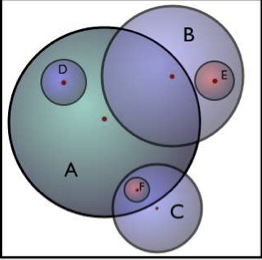

:orphan:

.. _rockstar_subhalo_nomenclature:

****************************************************
Rockstar halo and subhalo nomenclature conventions 
****************************************************

There is no universal convention for the nomenclature used in the discussion of 
halo catalogs. A common source of confusion centers around the meaning of the 
terms *subhalo* and *host halo*. In Halotools, we use the conventions adopted 
in Rockstar. The term *subhalo* refers to a halo whose present-day center resides 
within the present-day virial radius of a larger halo. 
A *host halo*, on the other hand, does not meet this criterion; host halos are 
thus distinct halos unto themselves, while subhalos by definition are members 
of some host halo. In the sections below, we describe how to extract information 
about a (sub)halo's host-identity from columns of Halotools-formatted catalogs. 
For more comprehensive information about the specific meaning of 
the columns of a Rockstar halo catalog, see the appendix of 
`Rodriguez Puebla et al 2016 <http://arxiv.org/abs/1602.04813>`_.

The definition of the ``halo_upid`` column 
==============================================

Thus members of any halo catalog fall into one of two disjoint categories: host halos and subhalos. 
All Halotools-formatted catalogs distinguish between these two categories with the *halo_upid* column. 
For host halos, *halo_upid = -1,* whereas for subhalos *halo_upid* is a long integer equal to the 
*halo_id* of the host halo. 

In cases where there may be confusion, throughout the documentation we will use the term *(sub)halo* 
to refer to an object that may be either a host or a sub. In cases where no confusion can arise, 
we may just use the term *halo*. 

The definition of the ``halo_hostid`` column 
==============================================

Halotools supplements the *halo_upid* column with another column called *halo_hostid*, defined such that 
*halo_upid = halo_hostid* for host halos, and *halo_hostid = halo_upid* for subhalos. 
Although this column is redundant with *halo_upid*, the *halo_hostid* column is much more convenient 
for certain kinds of calculations, particularly those which group host halo systems together. 

The definition of the ``halo_pid`` column 
==============================================

The category of subhalos may be further subdivided according to the *order* of the subhalo. For example, 
the term *sub-subhalo* refers to a subhalo that resides inside virial radius of another, more massive subhalo. 
A sub-subhalo may also be referred to as a *second-order subhalo*. The *halo_pid* column of any Halotools-formatted catalog can be used to identify whether a subhalo is a first- or higher-order subhalo. 
The *halo_pid* of an order-N subhalo stores the *halo_id* of the associated order-N-1 subhalo hosting it. 
Thus a subhalo with *halo_pid* that points to the *halo_id* of a host halo a first-order subhalo; 
for such an object, *halo_pid* and *halo_upid* store the same long integer. 
For a second-order subhalo, the *halo_pid* points to the immediate host, while the *halo_upid* points to the 
"uber-host", that is, the associated order-zero host object. 

Common "gotchas" with matching subhalos to their hosts 
================================================================

There are two "gotchas" to be aware of when matching a subhalo to its host. 
First, there will be some subhalos with a *halo_upid* that does not 
correspond to any *halo_id* in the catalog. The most common reason this happens is for 
sub/host halos with very similar values that are right on the boundary of a cut 
that was placed on the catalog. 

For example, suppose your halo catalog has been cut to store only those (sub)halos with 
:math:`V_{\rm peak} > 50 {\rm km/s}`. If there is a subhalo in the catalog with 
:math:`V_{\rm peak} = 51 {\rm km/s}` and a corresponding host with 
:math:`V_{\rm peak} = 49 {\rm km/s}`, then the *halo_upid* of this subhalo 
will point to an object that does not appear in the catalog. 

Second, in rare cases it is possible for a *halo_upid* to point to a *halo_id* of 
an object that is itself a subhalo. 

In the above diagram (taken from Figure 1 of `Jiang and van den Bosch 2014 <http://arxiv.org/abs/1403.6835>`_), 
object *E* will have a *halo_upid* that points to the *halo_id* of object *B*, even though 
object *B* is itself a subhalo of object *A*. This edge cases typically 
corresponds to situations in which a merge is in the process of taking place. 

