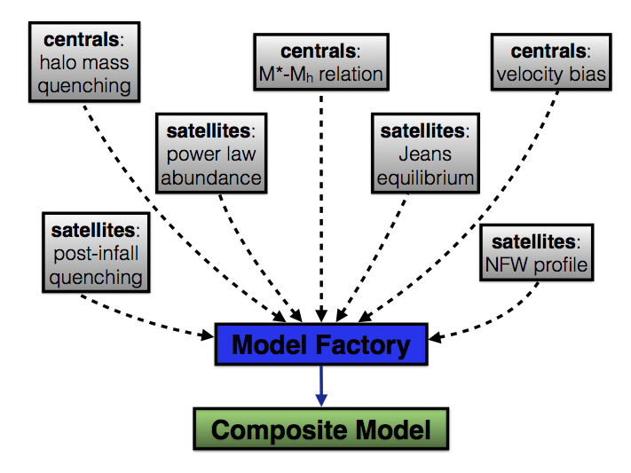

.. _model_building:

*************************************************
Tutorial on modeling the galaxy-halo connection
*************************************************

This section of the documentation is the starting point for in-depth tutorials 
on the model-building factories, which give you two basic options:  

	1. **Use a pre-built model.** Halotools ships with a handful of pre-built models based on some specific publication. Each pre-built model has many options for customizing its behavior, but also can populate mock catalogs and make a wide range of observational predictions right out of the box.  

	2. **Design your own model.** The Halotools factory design pattern allows you to build a model with fully customized behavior. You have the option to choose between Halotools-provided features, write all of your own features, or anywhere in between. 

Before diving in to the rest of the tutorial, in :ref:`preliminaries_on_halotools_model_building` we'll take a look at how Halotools models are designed in broad strokes. If you are already familiar with the basic outline of the Halotools factory design pattern, you may want to skip ahead to :ref:`further_reading_on_model_building` to choose the subsequent tutorial section that is most relevant to you. 

.. _preliminaries_on_halotools_model_building:

Preliminaries on Halotools model-building
=============================================

Basic terminology: *composite models* and *component models*
------------------------------------------------------------------

* A **composite model** is a complete description of the mapping(s) between dark matter halos and *all* properties of their resident galaxy population. A composite model provides sufficient information to populate an ensemble of halos with a Monte Carlo realization of a galaxy population. Such a population constitutes the fundamental observable prediction of the model.  

* A **component model** provides a map between dark matter halos and a single property of the resident galaxy population. Examples include the stellar-to-halo mass relation, an NFW radial profile and the halo mass-dependence of the quenched fraction. 

.. _factory_design_diagram: 

Overview of the factory design pattern
------------------------------------------------------------------

To get a better understanding of how composite models are composed of components, have a look at the following diagram. 

Each of the gray boxes represents a component model. In Halotools source code, component models are *instances* of a class responsible for modeling some particular feature(s) of the galaxy distribution. When you pass a collection of component models to the model factory, what you get is a composite model whose behavior is defined by that set of components. Halotools model factories provide a standardized interface so that no matter what choices you make for the component model features, all composite can directly populate mocks and compute astronomical observables with a uniform syntax. 

.. _further_reading_on_model_building:

Further reading on Halotools model-building
==============================================

Whether you use a pre-built model or one you build yourself, *all* Halotools models are based on the design pattern described above. With this basic picture in mind, you should now choose between the following two branches of this tutorial:

.. toctree::
   :maxdepth: 1

   preloaded_models/index
   composing_models/index

