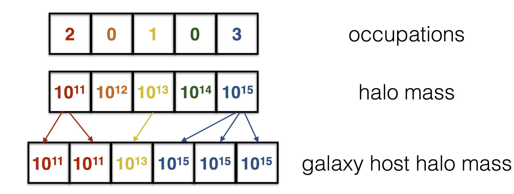

:orphan:

.. currentmodule:: halotools.empirical_models

.. _hod_mock_factory_source_notes:

********************************************************************
Tutorial on the algorithm for HOD-based mock-making
********************************************************************

This section of the documentation provides detailed notes
for how the `HodMockFactory` populates halo catalogs with synthetic galaxy populations.
The `HodMockFactory` uses composite models built with the `HodModelFactory`, which
is documented in the :ref:`hod_model_factory_source_notes`.

The bookkeeping of every step of the mock-generation is described in detail below.
The design of the algorithm was built around the following considerations:

1. The `HodMockFactory` should be able to correctly control mock-generation for an interchangeable set of (possibly inter-dependent) mappings from a halo table to a galaxy table.
2. It should be easy for users to include just a single additional mapping without having to worry about any of the tedious bookkeeping of how memory is allocated for other galaxy properties or galaxy types.

These two goals together drive the `HodMockFactory` to be written with a high-level of abstraction.
So the price paid for the modeling flexibility and the user-friendliness of designing
new features is that the `HodMockFactory` gluing these behaviors together is complex.
In this tutorial we describe every step in this abstract process,
including a detailed look at the source code.

Outline
========

We will start in :ref:`basic_syntax_hod_mocks` with a high-level overview of the functionality
of the `HodMockFactory` class. We provide detailed
notes on the source code of the mock factory in :ref:`hod_mock_algorithm`.

.. _basic_syntax_hod_mocks:

Basic syntax for making HOD-style mocks
===============================================

The most common way to interact with
instances of the `HodMockFactory` is as an attribute of the composite model you
are using to generate the mock. For example, the code snippet below shows how
the `~HodModelFactory.populate_mock` method creates a ``mock`` object to
the composite model, which in this case will be a model based on Zheng et al. (2007):

.. code-block:: python

    from halotools.empirical_models import PrebuiltHodModelFactory
    zheng07_model = PrebuiltHodModelFactory('zheng07')

    from halotools.sim_manager import CachedHaloCatalog
    default_halocat = CachedHaloCatalog()

    zheng07_model.populate_mock(default_halocat)

The final line of code above creates the ``zheng07_model.mock`` attribute,
an instance of `HodMockFactory`.

The `HodMockFactory` is responsible for one task: using a Halotools composite model
to populate a simulation with mock galaxies.
When the `HodModelFactory.populate_mock` method first creates a ``model.mock`` instance,
the instantiation of `HodMockFactory` triggers the pre-processing phase of mock population.
Briefly, this phase does as many tasks in advance of actual mock population as possible
to improve the efficiency of MCMCs (see below for details).

By default, instantiating the mock factory also triggers
the `HodMockFactory.populate` method to be called. This is the method that actually creates
the galaxy population. By calling the `HodMockFactory.populate` method,
a new ``galaxy_table`` attribute is created and bound to the ``model.mock`` instance.
The ``galaxy_table`` attribute stores an Astropy `~astropy.table.Table` object with one row
per mock galaxy and one column for every property assigned by the chosen composite model.

.. _hod_mock_algorithm:

Algorithm for populating HOD-style mocks
================================================

.. _intro_to_np_repeat:

Basics of `numpy.repeat`: the core function in HOD mock-making
----------------------------------------------------------------

Before going into the details of the `HodMockFactory.populate` method,
in this section we will first cover a basic introduction to the `numpy.repeat` function,
which is the single-most important Numpy function used by Halotools to make mock catalogs.

First let's demonstrate basic usage:

>>> import numpy as np
>>> num_halos = 5
>>> halo_mass = np.logspace(11, 15, num_halos)
>>> halo_occupations = np.array([2, 0, 1, 0, 3])
>>> galaxy_host_halo_mass = np.repeat(halo_mass, halo_occupations)

The `numpy.repeat` function takes as input two arrays of equal length,
in this case ``halo_mass`` and ``halo_occupations``. The second array is interpreted
as the number of times the corresponding entry in the first array should be repeated.
A visualization of how this function behaves is shown in the diagram below.

This behavior is exactly what is needed to create a mock galaxy catalog with an HOD-style model.
The `numpy.repeat` function is blazingly fast and ideally suited to the task at hand.
The core function of any HOD model is to specify how many galaxies reside in a given halo.
The task of assigning galaxy occupations to halos is controlled by
the `~halotools.empirical_models.OccupationComponent.mc_occupation` function
of whatever sub-class of `~halotools.empirical_models.OccupationComponent` you select as your model.
The `~halotools.empirical_models.HodMockFactory` does not need to know how occupation statistics
are modeled - the only thing the factory needs to do is call
the `~halotools.empirical_models.OccupationComponent.mc_occupation` function to fill the
``occupations`` array in the diagram.
The `~halotools.empirical_models.HodMockFactory` simply calls `numpy.repeat`,
passing (in this example) the ``halo_mvir`` column of the halo catalog as the first argument.
This will create a length-*Ngals* array storing the host halo mass of every mock galaxy,
which will then be included in the ``galaxy_table``.
If you want to include additional halo properties as columns in your ``galaxy_table``,
the `~halotools.empirical_models.HodMockFactory` only needs to pass in additional
halo catalog columns to `numpy.repeat`. In this way, the factory does not need to know *anything*
about how the ``occupations`` array comes into existence. The factory
only needs to repeatedly call `numpy.repeat` with the appropriate inputs that are
determined by the model.

Pre-processing phase
----------------------

The preliminary tasks of HOD mock-making are carried out by the
`~HodMockFactory.preprocess_halo_catalog` method. This first thing this function does
is to throw out subhalos from the halo catalog, and to apply a halo mass completeness cut.
You can control the completeness cut with the ``Num_ptcl_requirement`` keyword argument passed
to the `HodMockFactory` constructor (``Num_ptcl_requirement`` is also an optional keyword argument
that may be passed to the `HodModelFactory.populate_mock` method, which in turn passes this argument
on to the `HodMockFactory` constructor.)

New columns are then added to the ``halo_table``
according to any entries in the ``new_haloprop_func_dict``; any such columns will automatically be included
in the ``galaxy_table``. See :ref:`new_haloprop_func_dict_mechanism` for further details.

Memory allocation phase
---------------------------

After pre-processing the halo catalog, memory must be allocated to store the ``galaxy_table``.
This is controlled by the `~HodMockFactory.allocate_memory` method, the first few lines of which
appear below.

.. code-block:: python

    def allocate_memory(self):

        self.galaxy_table = Table() # ``self`` refers to the ``model.mock`` object
        self._remaining_methods_to_call = copy(self.model._mock_generation_calling_sequence)

After initializing the ``galaxy_table``,
the `~HodMockFactory.allocate_memory` method creates the ``_remaining_methods_to_call``
attribute; this will be used to keep a running list of the names of the
composite model methods that the `HodMockFactory` should call;
the factory calls the methods in this list one by one, deleting the corresponding name
after the call; when the list is exhausted, mock-making is complete.

For every ``gal_type`` in a composite model, e.g., ``centrals`` or ``satellites``,
there is a corresponding ``mc_occupation_gal_type`` method that is responsible for
determining how many galaxies of that type belong in each halo, e.g.,
``mc_occupation_centrals`` or ``mc_occupation_satellites``.
As described in the previous section and elaborated upon in detail below,
these ``mc_occupation`` methods work together with
`numpy.repeat` to build the ``galaxy_table``.

In HOD-style models, there is a natural division between the component model methods that
get called by the `HodMockFactory`:

1. methods that are called *prior* to the ``mc_occupation`` methods
2. the ``mc_occupation`` methods themselves
3. methods that are called *after* the ``mc_occupation`` methods.

For the first set of methods, memory has not yet been allocated for the ``galaxy_table``
as the length of the table is determined by the result of the call to the ``mc_occupation``
methods, which has stochastic behavior.
For the third set of methods, the length of the ``galaxy_table`` has already been
determined, and so these methods merely fill existing (empty) columns of the ``galaxy_table``.

.. _galprops_assigned_before_mc_occupation:

Galaxy properties assigned prior to the ``mc_occupation`` methods
~~~~~~~~~~~~~~~~~~~~~~~~~~~~~~~~~~~~~~~~~~~~~~~~~~~~~~~~~~~~~~~~~~~~~~~~

As described above, the functions whose names appear in the
``_remaining_methods_to_call`` list are called in sequence by the `HodMockFactory`.
For all functions that appear in this list *prior* to the first appearance of the
``mc_occupation_`` functions, the data structure passed to the functions
via the *table* keyword is the (post-processed) ``mock.halo_table``.
Thus whatever values these functions compute, the result of the functions
will be stored in ``mock.halo_table``. The reason that the functions in this phase
are not directly passed ``mock.galaxy_table`` is because we do not know how many
elements this table will have until calling the ``mc_occupation_`` methods.
Moreover, functions in this phase are by definition modeling some
property of the galaxy population that does not even need to know
which galaxies the property pertains to. Thus model functions that are called
prior to the ``mc_occupation_`` methods can only depend on
the underlying halo, and so these functions should have sufficient knowledge to map
their results on an input halo catalog.

All the same, any function in the ``_mock_generation_calling_sequence`` should have
the results of its computations applied to the ``galaxy_table``. As we will see
in the next section, this transfer of information can be accomplished with
`numpy.repeat`. Before seeing how that's done, let's look at the source code that generates
the behavior we just described.

.. code-block:: python

    galprops_assigned_to_halo_table = []
    for func_name in self.model._mock_generation_calling_sequence:
        if 'mc_occupation' in func_name:
            # exit when we encounter a ``mc_occupation_`` function
            break
        else:
            func = getattr(self.model, func_name)
            func(table = self.halo_table)
            galprops_assigned_to_halo_table_by_func = func._galprop_dtypes_to_allocate.names
            galprops_assigned_to_halo_table.extend(galprops_assigned_to_halo_table_by_func)
            self._remaining_methods_to_call.remove(func_name)

    self.additional_haloprops.extend(galprops_assigned_to_halo_table)

After executing the above for loop, all functions in the ``_mock_generation_calling_sequence``
that appear prior to the ``mc_occupation_`` methods will have been executed after being
passed the ``halo_table`` as the data structure bound to the ``table`` keyword argument.
Additionally, the ``galprops_assigned_to_halo_table_by_func`` list works with
:ref:`galprop_dtypes_to_allocate_mechanism` mechanism to keep track of
which data columns we will pass on from the ``halo_table`` to the ``galaxy_table``
after allocating memory for the ``galaxy_table`` with the ``mc_occupation_`` methods.
After calling the ``mc_occupation_`` methods, we will use `numpy.repeat` to transfer all columns
appearing in ``additional_haloprops`` from the ``halo_table`` to the ``galaxy_table``.

Calling the ``mc_occupation_`` methods
~~~~~~~~~~~~~~~~~~~~~~~~~~~~~~~~~~~~~~~~~~~~~~~~~~~~~~~~~~~~~~~~~~~~~~~~

The `HodMockFactory` marches through the mock-generation functions listed
in ``_mock_generation_calling_sequence`` until the first time a function with name
``mc_occupation_`` appears, triggering a new phase of the mock generation in which
memory is allocated to the ``galaxy_table``.

The basic way this next phase works is as follows. The ``halo_table`` is passed
to each of the ``mc_occupation_`` functions; these functions are called in the sequence
in which their corresponding ``gal_type`` appears in ``self.gal_types``.
For example, if ``self.gal_types = ['centrals', 'satellites']``, then the
calling sequence of this phase will be ``mc_occupation_centrals`` followed by
``mc_occupation_satellites``.
For each ``gal_type`` in the composite model,
the ``mc_occupation_gal_type`` function call will calculate a length-*Nhalos* array
of integers that determines how many galaxies of that type belong in each halo.
This integer array is stored in a private python dictionary ``self._occupation``;
there are *num_gal_types* keys in ``self._occupation``,
one key for the array of occupations associated with each ``gal_type``.

Discussion of the ``mc_occupation_`` phase continues below the following source code
that controls the behavior we are describing.

.. code-block:: python

    self._occupation = {}
    self._total_abundance = {}
    self._gal_type_indices = {}

    first_galaxy_index = 0
    for gal_type in self.gal_types:
        occupation_func_name = 'mc_occupation_'+gal_type
        occupation_func = getattr(self.model, occupation_func_name)
        # Call the component model to get a Monte Carlo
        # realization of the abundance of gal_type galaxies
        self._occupation[gal_type] = occupation_func(table=self.halo_table)

        # Now use the above result to set up the indexing scheme
        self._total_abundance[gal_type] = (
            self._occupation[gal_type].sum()
            )
        last_galaxy_index = first_galaxy_index + self._total_abundance[gal_type]
        # Build a bookkeeping device to keep track of
        # which array elements pertain to which gal_type.
        self._gal_type_indices[gal_type] = slice(
            first_galaxy_index, last_galaxy_index)
        first_galaxy_index = last_galaxy_index
        # Remove the mc_occupation function from the list of methods to call
        self._remaining_methods_to_call.remove(occupation_func_name)
        self.additional_haloprops.append('halo_num_'+gal_type)

    self.Ngals = np.sum(list(self._total_abundance.values()))

After calling the ``occupation_func`` for a given ``gal_type``, we know exactly how many
galaxies of that type will appear in our mock. The total abundance of galaxies of a given
type is stored in the ``self._total_abundance`` dictionary. The keys and integers stored
in this dictionary determine the memory layout of the ``galaxy_table``. Suppose we have
three galaxy types, ``centrals``, ``satellites`` and ``splashbacks``. The first
``num_centrals = self._total_abundance['centrals']`` rows of the ``galaxy_table``
store the information about our population of centrals; the next ``num_satellites`` rows
are dedicated to the satellites; the final ``num_splashbacks`` rows stores the properties
of the splashback galaxies.

Once these bookkeeping dictionaries have been built, allocating memory for the ``galaxy_table``
is straightforward. We just need to initialize all the columns to which values will be
assigned by the functions that still appear in ``self._remaining_methods_to_call``.
The initialization is just a `numpy.zeros` array of the appropriate data type.
These arrays will be filled during the third and final stage of mock-making.

.. code-block:: python

    # Allocate memory for all additional halo properties
    for halocatkey in self.additional_haloprops:
        self.galaxy_table[halocatkey] = np.zeros(self.Ngals,
            dtype = self.halo_table[halocatkey].dtype)

    dt = self.model._galprop_dtypes_to_allocate
    for key in dt.names:
        self.galaxy_table[key] = np.zeros(self.Ngals, dtype = dt[key].type)

.. _mock_generation_functions_after_mc_occupation:

Final stage: galaxy properties assigned after the ``mc_occupation`` methods
~~~~~~~~~~~~~~~~~~~~~~~~~~~~~~~~~~~~~~~~~~~~~~~~~~~~~~~~~~~~~~~~~~~~~~~~~~~~~~

After the ``galaxy_table`` has been initialized, the ``allocate_memory`` method
is complete and control is returned to the ``populate`` method. The first
thing the ``populate`` method does is transfer all the necessary halo properties
from the ``halo_table`` to the ``galaxy_table``. Recall the ``galaxy_table`` memory layout
described in the previous section when viewing the following code block:

.. code-block:: python

    for gal_type in self.gal_types:

        # Retrieve the indices of our pre-allocated arrays
        # that store the info pertaining to gal_type galaxies
        gal_type_slice = self._gal_type_indices[gal_type]

        # Fill the relevant slice of the ``gal_type`` column with the appropriate string
        self.galaxy_table['gal_type'][gal_type_slice] = (
            np.repeat(gal_type, self._total_abundance[gal_type],axis=0))

        # Store all other relevant host halo properties into their
        # appropriate pre-allocated array
        for halocatkey in self.additional_haloprops:
            self.galaxy_table[halocatkey][gal_type_slice] = np.repeat(
                self.halo_table[halocatkey], self._occupation[gal_type], axis=0)

At this point, the ``galaxy_table`` stores all the halo properties needed by
the composite model, and so when we proceed to call the remaining mock-generation
functions, we can safely pass these functions the appropriate slice of the
``galaxy_table`` and rest assured that the functions will have all the information
they need to assign whatever property they are responsible for.

The functions responsible for modeling the intra-halo distribution of galaxies
(e.g., an `NFWProfile` for satellites and a `TrivialProfile` for centrals)
model *host-centric* positions, so we initialize the positions of each galaxy
to be at its halo center.

.. code-block:: python

    self.galaxy_table['x'] = self.galaxy_table['halo_x']
    self.galaxy_table['y'] = self.galaxy_table['halo_y']
    self.galaxy_table['z'] = self.galaxy_table['halo_z']
    self.galaxy_table['vx'] = self.galaxy_table['halo_vx']
    self.galaxy_table['vy'] = self.galaxy_table['halo_vy']
    self.galaxy_table['vz'] = self.galaxy_table['halo_vz']

Finally, the loop below is where all the action happens with galaxy property assignment:

.. code-block:: python

    for method in self._remaining_methods_to_call:
        func = getattr(self.model, method)
        gal_type_slice = self._gal_type_indices[func.gal_type]
        func(table = self.galaxy_table[gal_type_slice])

We perform a loop over all functions whose names remain in
``self._remaining_methods_to_call``. All functions appearing in this list
have a ``gal_type`` attribute bound to them that was created by the
`HodModelFactory` during the assembly of the composite model
(see the :ref:`hod_model_factory_inheriting_behaviors` section of the
:ref:`hod_model_factory_source_notes` for further details about how the `HodModelFactory`
binds the appropriate ``gal_type`` information to each mock-generation function).
This ``gal_type`` determines the slice of the ``galaxy_table`` that will be passed to the
function via the ``table`` keyword argument. This way, each component model
does not need to manage any bookkeeping about which slice of an input table
it assigns its properties to: the `HodMockFactory` is responsible for passing
the slice of the ``galaxy_table`` that pertains to the ``gal_type`` of the component model.

The generation of all properties predicted by the model is now complete.
The `HodMockFactory.populate` function terminates after enforcing the
periodic boundary conditions of the simulation. This enforcement is controlled
by the `HodMockFactory` because component models of halo profiles strictly
assign halo-centric positions. Thus corrections need to be applied to
cases where galaxies are assigned to regions of the halo
that spilled over the edges of the simulation box.

.. _which_data_table_hod_mock_making:

Summary: which data table is passed to the ``table`` keyword argument in HOD mock-making?
===========================================================================================

As described in detail in :ref:`hod_modeling_tutorial0`, all methods in the
``_mock_generation_calling_sequence`` of any HOD-style composite model
must accept a ``table`` keyword argument. As shown above, the actual data structure
passed via this argument depends on the phase of the mock-making in which
the function is called. We conclude this tutorial by quickly summarizing
which data structure gets passed to which function.

1. Mock-generation functions whose names appear *prior* to the first appearance of a ``mc_occupation_`` function get passed the *entire* post-processed ``model.mock.halo_table`` to their ``table`` keyword argument.
2. ``mc_occupation_`` functions also receive the entire ``model.mock.halo_table`` via their ``table`` keyword argument.
3. Mock-generation functions whose names appear *after* the first ``mc_occupation_`` function get passed a *slice* of the ``model.mock.galaxy_table``; the slice they are passed is the section of the table that pertains to the ``gal_type`` the function is associated with.

